# TÀI LIỆU CHI TIẾT: MỐI QUAN HỆ GIỮA CÁC BẢNG TRONG CƠ SỞ DỮ LIỆU
## DỰ ÁN NỀN TẢNG KẾT NỐI FREELANCER SINH VIÊN (FREELANCERSTUDENTS)
> **Cơ sở dữ liệu:** `KLCN040_FREELANCERSTUDENT.sql`  
> **Quy mô:** 36 Bảng dữ liệu | 6 Cụm nghiệp vụ chính  
> **Các loại quan hệ:** 1 - 1 (Một - Một), 1 - N (Một - Nhiều), N - N (Nhiều - Nhiều thông qua bảng liên kết)

---

## I. SƠ ĐỒ THỰC THỂ LIÊN KẾT TỔNG THỂ (FULL ERD MERMAID DIAGRAM)

```mermaid
erDiagram
    %% ==========================================
    %% CỤM 1: AUTH & HỒ SƠ NGƯỜI DÙNG
    %% ==========================================
    Roles ||--o{ Users : "1 - N (phân quyền tài khoản)"
    Users ||--o| FreelancerStudents : "1 - 1 (mở rộng hồ sơ sinh viên)"
    Users ||--o| NhaTuyenDung : "1 - 1 (mở rộng hồ sơ NTD)"
    Users ||--o| Admin : "1 - 1 (mở rộng tài khoản quản trị)"
    Users ||--o| Wallet : "1 - 1 (sở hữu ví điện tử)"
    Users ||--o{ ThongBao : "1 - N (nhận thông báo)"
    Users ||--o{ YeuCauHoTro : "1 - N (gửi ticket hỗ trợ)"

    ChuyenNganh ||--o{ FreelancerStudents : "1 - N (thuộc chuyên ngành)"
    FreelancerStudents ||--o{ MinhChung_FreelancerStudents : "1 - N (tải lên minh chứng SV)"
    FreelancerStudents ||--o{ KynangChuyennganh_FreelancerStudent : "1 - N (kỹ năng chuyên môn)"
    FreelancerStudents ||--o| Portfolio : "1 - 1 (hồ sơ năng lực portfolio)"
    Portfolio ||--o{ DuAn_Trong_Portfolio : "1 - N (các dự án mẫu)"
    FreelancerStudents ||--o{ BaiDangTimViec_FreelancerStudent : "1 - N (đăng tin tìm việc)"
    FreelancerStudents ||--o{ TaiKhoanNganHang : "1 - N (liên kết ngân hàng rút tiền)"

    %% ==========================================
    %% CỤM 2: TUYỂN DỤNG & KẾT NỐI ỨNG TUYỂN
    %% ==========================================
    NhaTuyenDung ||--o{ JobPost : "1 - N (đăng bài tuyển dụng)"
    NhaTuyenDung ||--o{ FreelancerYeuThich : "1 - N (lưu FRL quan tâm)"
    FreelancerStudents ||--o{ FreelancerYeuThich : "1 - N (được quan tâm)"

    JobPost ||--o{ UngTuyen : "1 - N (nhận đơn ứng tuyển)"
    FreelancerStudents ||--o{ UngTuyen : "1 - N (nộp đơn ứng tuyển)"

    NhaTuyenDung ||--o{ UngThue : "1 - N (gửi lời mời thuê trực tiếp)"
    FreelancerStudents ||--o{ UngThue : "1 - N (nhận lời mời thuê)"

    %% ==========================================
    %% CỤM 3: HỢP ĐỒNG & THỰC THI DỰ ÁN
    %% ==========================================
    JobPost ||--o| HopDong : "1 - 1 (hình thành hợp đồng)"
    FreelancerStudents ||--o{ HopDong : "1 - N (bên B thực hiện hợp đồng)"
    HopDong ||--o{ GiaiDoan_HopDong : "1 - N (các mốc tiến độ thanh toán)"
    HopDong ||--o{ Task_CongViec : "1 - N (nhiệm vụ kỹ thuật)"
    HopDong ||--o{ BanGiao_SanPham : "1 - N (nộp sản phẩm bàn giao)"
    HopDong ||--o{ YeuCauGiaHanDeadline : "1 - N (yêu cầu gia hạn thời gian)"
    HopDong ||--o{ DanhGia_NhanXet : "1 - N (đánh giá & nhận xét 2 chiều)"
    HopDong ||--o| KyQuy : "1 - 1 (bảo chứng tiền Escrow)"

    %% ==========================================
    %% CỤM 4: TÀI CHÍNH & VÍ ĐIỆN TỬ (ESCROW)
    %% ==========================================
    Wallet ||--o{ LichSuGiaoDich : "1 - N (nhật ký biến động số dư)"
    Wallet ||--o{ YeuCauNapTien : "1 - N (yêu cầu nạp tiền ví)"
    Wallet ||--o{ YeuCauRutTien : "1 - N (yêu cầu rút tiền về bank)"

    %% ==========================================
    %% CỤM 5: TRANH CHẤP & TRỌNG TÀI
    %% ==========================================
    HopDong ||--o{ TranhChap : "1 - N (khiếu nại tranh chấp hợp đồng)"
    TranhChap ||--o{ BANGCHUNG_TRANHCHAP : "1 - N (chứa tài liệu/ảnh bằng chứng)"

    %% ==========================================
    %% CỤM 6: GIAO TIẾP & GIÁM SÁT HỆ THỐNG
    %% ==========================================
    HopDong ||--o| PhongChat : "1 - 1 (kênh trao đổi hợp đồng)"
    PhongChat ||--o{ TinNhanChat : "1 - N (tin nhắn giữa 2 bên)"
    PhongChat ||--o{ FileGhimChat : "1 - N (tài liệu ghim trong box chat)"

    Admin ||--o{ LichSu_XuLyTaiKhoan : "1 - N (nhật ký khóa/mở User)"
    Admin ||--o{ DieuChinhSoDu : "1 - N (lệnh điều chỉnh số dư ví)"
    Admin ||--o{ CauHinhPhiHoaHong_PhiDangBai : "1 - N (cấu hình biểu phí)"
```

---

## II. BẢNG TỔNG HỢP CHI TIẾT MỐI QUAN HỆ GIỮA CÁC BẢNG (36 BẢNG)

| STT | Bảng Gốc (Parent / Primary) | Bảng Liên Kết (Child / Foreign) | Loại Quan Hệ | Khóa Chính (PK) | Khóa Ngoại (FK) | Ý nghĩa nghiệp vụ chi tiết |
| :---: | :--- | :--- | :---: | :--- | :--- | :--- |
| **1** | `Roles` | `Users` | **1 - N** | `Roles.MaRole` | `Users.MaRole` | Một vai trò (Sinh viên, NTD, Admin) có nhiều tài khoản người dùng thuộc vai trò đó. |
| **2** | `Users` | `FreelancerStudents` | **1 - 1** | `Users.MaUser` | `FreelancerStudents.MaUser` | Một User vai trò sinh viên có duy nhất 1 hồ sơ học vấn, GPA, chuyên ngành. |
| **3** | `Users` | `NhaTuyenDung` | **1 - 1** | `Users.MaUser` | `NhaTuyenDung.MaUser` | Một User vai trò doanh nghiệp có duy nhất 1 hồ sơ công ty/tuyển dụng. |
| **4** | `Users` | `Admin` | **1 - 1** | `Users.MaUser` | `Admin.MaUser` | Một User vai trò quản trị viên có 1 bản ghi định danh Admin. |
| **5** | `Users` | `Wallet` | **1 - 1** | `Users.MaUser` | `Wallet.MaUser` | Mỗi tài khoản người dùng sở hữu duy nhất 1 ví tiền điện tử để thanh toán và nhận thù lao. |
| **6** | `ChuyenNganh` | `FreelancerStudents` | **1 - N** | `ChuyenNganh.MaChuyenNganh` | `FreelancerStudents.MaChuyenNganh` | Một chuyên ngành đào tạo (CNTT, Thiết kế đồ họa, Marketing...) có nhiều sinh viên theo học. |
| **7** | `FreelancerStudents` | `MinhChung_FreelancerStudents` | **1 - N** | `FreelancerStudents.MaFreelancerStudents` | `MinhChung.MaFreelancerStudent` | Một sinh viên có thể gửi nhiều minh chứng (Thẻ sinh viên, Bảng điểm, Giấy xác nhận) để Admin phê duyệt. |
| **8** | `FreelancerStudents` | `KynangChuyennganh_FreelancerStudent` | **1 - N** | `FreelancerStudents.MaFreelancerStudents` | `Kynang.MaFreelancerStudent` | Một sinh viên sở hữu danh sách nhiều kỹ năng chuyên môn chi tiết. |
| **9** | `FreelancerStudents` | `Portfolio` | **1 - 1** | `FreelancerStudents.MaFreelancerStudents` | `Portfolio.MaFreelancerStudent` | Mỗi sinh viên có duy nhất 1 trang Portfolio tổng hợp năng lực cá nhân. |
| **10** | `Portfolio` | `DuAn_Trong_Portfolio` | **1 - N** | `Portfolio.MaPortfolio` | `DuAn.MaPortfolio` | Một Portfolio chứa nhiều dự án/sản phẩm mẫu đã hoàn thành trong quá khứ. |
| **11** | `FreelancerStudents` | `BaiDangTimViec_FreelancerStudent` | **1 - N** | `FreelancerStudents.MaFreelancerStudents` | `BaiDang.MaFreelancerStudent` | Một sinh viên có thể chủ động đăng nhiều tin tìm việc với mức giá và kỹ năng khác nhau. |
| **12** | `FreelancerStudents` | `TaiKhoanNganHang` | **1 - N** | `FreelancerStudents.MaFreelancerStudents` | `TaiKhoanNganHang.MaFreelancerStudent` | Một sinh viên có thể liên kết nhiều số tài khoản ngân hàng để nhận tiền rút. |
| **13** | `NhaTuyenDung` | `JobPost` | **1 - N** | `NhaTuyenDung.MaNhaTuyenDung` | `JobPost.MaNhaTuyenDung` | Một Nhà tuyển dụng có thể đăng tuyển nhiều gói công việc/dự án khác nhau. |
| **14** | `JobPost` + `FreelancerStudents` | `UngTuyen` | **N - N**  *(1-N từ mỗi bên)* | `JobPost.MaJob`   `FRL.MaFreelancerStudents` | `UngTuyen.MaJob`   `UngTuyen.MaFreelancerStudents` | **Nhiều - Nhiều**: Nhiều sinh viên có thể ứng tuyển vào 1 Job; 1 sinh viên có thể nộp đơn vào nhiều Job. |
| **15** | `NhaTuyenDung` + `FreelancerStudents` | `UngThue` | **N - N**  *(1-N từ mỗi bên)* | `NTD.MaNhaTuyenDung`   `FRL.MaFreelancerStudents` | `UngThue.MaNhaTuyenDung`   `UngThue.MaFreelancerStudents` | **Nhiều - Nhiều**: NTD gửi lời mời làm việc trực tiếp đến nhiều sinh viên; 1 sinh viên nhận nhiều lời mời thuê. |
| **16** | `NhaTuyenDung` + `FreelancerStudents` | `FreelancerYeuThich` | **N - N**  *(1-N từ mỗi bên)* | `NTD.MaNhaTuyenDung`   `FRL.MaFreelancerStudents` | `YeuThich.MaNhaTuyenDung`   `YeuThich.MaFreelancerStudents` | **Nhiều - Nhiều**: NTD lưu danh sách nhiều sinh viên tiềm năng; 1 sinh viên có thể được nhiều NTD lưu. |
| **17** | `JobPost` | `HopDong` | **1 - 1** | `JobPost.MaJob` | `HopDong.MaJob` | Một bài đăng tuyển dụng khi chốt ứng viên sẽ hình thành duy nhất 1 hợp đồng pháp lý chính thức. |
| **18** | `FreelancerStudents` | `HopDong` | **1 - N** | `FreelancerStudents.MaFreelancerStudents` | `HopDong.MaFreelancerStudent` | Một sinh viên có thể ký kết và thực hiện nhiều hợp đồng lao động theo thời gian. |
| **19** | `HopDong` | `KyQuy` | **1 - 1** | `HopDong.MaHD` | `KyQuy.MaHD` | Mỗi hợp đồng có đúng 1 giao dịch bảo chứng ký quỹ Escrow tương ứng 100% giá trị hợp đồng. |
| **20** | `HopDong` | `GiaiDoan_HopDong` | **1 - N** | `HopDong.MaHD` | `GiaiDoan.MaHD` | Một hợp đồng có thể chia làm nhiều mốc tiến độ thanh toán giải ngân (Milestones). |
| **21** | `HopDong` | `Task_CongViec` | **1 - N** | `HopDong.MaHD` | `Task.MaHD` | Một hợp đồng có nhiều đầu việc/nhiệm vụ kỹ thuật cần bàn giao. |
| **22** | `HopDong` | `BanGiao_SanPham` | **1 - N** | `HopDong.MaHD` | `BanGiao.MaHD` | Một hợp đồng có thể có nhiều lần nộp phiên bản sản phẩm bàn giao (nộp lần đầu, nộp chỉnh sửa). |
| **23** | `HopDong` | `YeuCauGiaHanDeadline` | **1 - N** | `HopDong.MaHD` | `GiaHan.MaHD` | Một hợp đồng có thể phát sinh nhiều lần yêu cầu xin gia hạn tiến độ thực hiện. |
| **24** | `HopDong` | `DanhGia_NhanXet` | **1 - N** | `HopDong.MaHD` | `DanhGia.MaHD` | Một hợp đồng có tối đa 2 đánh giá (NTD nhận xét Sinh viên và Sinh viên nhận xét NTD). |
| **25** | `Wallet` | `LichSuGiaoDich` | **1 - N** | `Wallet.MaWallet` | `LichSuGiaoDich.MaWallet` | Một ví tiền có nhiều giao dịch phát sinh biến động số dư (Nạp, Đặt cọc Escrow, Nhận lương, Trừ phí). |
| **26** | `Wallet` | `YeuCauNapTien` | **1 - N** | `Wallet.MaWallet` | `YeuCauNapTien.MaWallet` | Một ví tiền có thể tạo nhiều lệnh nạp tiền qua cổng ngân hàng/chuyển khoản. |
| **27** | `Wallet` | `YeuCauRutTien` | **1 - N** | `Wallet.MaWallet` | `YeuCauRutTien.MaWallet` | Một ví tiền sinh viên có thể tạo nhiều yêu cầu rút tiền về tài khoản ngân hàng. |
| **28** | `HopDong` | `TranhChap` | **1 - N** | `HopDong.MaHD` | `TranhChap.MaHD` | Một hợp đồng nếu xảy ra bất đồng có thể tạo khiếu nại tranh chấp gửi lên Ban Quản trị sàn. |
| **29** | `TranhChap` | `BANGCHUNG_TRANHCHAP` | **1 - N** | `TranhChap.MaTranhChap` | `BangChung.MaTranhChap` | Một vụ tranh chấp có thể đính kèm nhiều hình ảnh, tài liệu hoặc file làm bằng chứng chứng minh. |
| **30** | `HopDong` | `PhongChat` | **1 - 1** | `HopDong.MaHD` | `PhongChat.MaHD` | Mỗi hợp đồng được khởi tạo 1 phòng chat riêng biệt để trao đổi xuyên suốt dự án. |
| **31** | `PhongChat` | `TinNhanChat` | **1 - N** | `PhongChat.MaPhongChat` | `TinNhanChat.MaPhongChat` | Một phòng chat lưu trữ toàn bộ lịch sử các tin nhắn gửi đi giữa hai bên. |
| **32** | `PhongChat` | `FileGhimChat` | **1 - N** | `PhongChat.MaPhongChat` | `FileGhim.MaPhongChat` | Một phòng chat có thể ghim nhiều tài liệu quan trọng để tra cứu nhanh. |
| **33** | `Users` | `ThongBao` | **1 - N** | `Users.MaUser` | `ThongBao.MaUser` | Một người dùng nhận được nhiều thông báo sự kiện theo thời gian thực từ hệ thống. |
| **34** | `Users` | `YeuCauHoTro` | **1 - N** | `Users.MaUser` | `YeuCauHoTro.MaUser` | Một người dùng có thể gửi nhiều ticket yêu cầu trợ giúp kỹ thuật đến Admin. |
| **35** | `Admin` | `LichSu_XuLyTaiKhoan` | **1 - N** | `Admin.MaAdmin` | `LichSuXuLy.MaAdmin` | Một Admin thực hiện nhiều hành động khóa hoặc mở khóa tài khoản người dùng vi phạm. |
| **36** | `Admin` | `DieuChinhSoDu` | **1 - N** | `Admin.MaAdmin` | `DieuChinhSoDu.MaAdmin` | Một Admin có thể thực hiện nhiều lệnh điều chỉnh số dư ví khi xử lý sự cố tài chính. |

---

## III. PHÂN TÍCH QUY TẮC TOÀN VẸN & RÀNG BUỘC NGHIỆP VỤ (BUSINESS INTEGRITY RULES)

### 1. Phân cấp Tài khoản (User Specialization - 1:1)
- Bảng `Users` là thực thể cha trung tâm lưu thông tin xác thực (`EmailUser`, `TenTaiKhoanUser`, `PashwordHash`, `SdtUser`, `Status`).
- Tùy theo `MaRole`:
  - `MaRole = 1`: Sinh viên $\rightarrow$ Liên kết 1-1 với `FreelancerStudents`.
  - `MaRole = 2`: Nhà tuyển dụng $\rightarrow$ Liên kết 1-1 với `NhaTuyenDung`.
  - `MaRole = 3`: Quản trị viên $\rightarrow$ Liên kết 1-1 với `Admin`.

### 2. Chu trình Hợp đồng & Ký quỹ Bảo chứng (Escrow Mechanism - 1:1:1)
- Chu trình chuẩn: `JobPost` $\rightarrow$ `UngTuyen` (chấp nhận) $\rightarrow$ `HopDong` (tạo hợp đồng) $\rightarrow$ `KyQuy` (đóng băng 100% tiền cọc).
- Mối quan hệ giữa `HopDong` và `KyQuy` là **1 - 1**: Đảm bảo không thể có hợp đồng nào hoạt động mà không có quỹ bảo chứng tại sàn.
- Tiền trong `KyQuy` chỉ được giải ngân vào `Wallet` của Sinh viên sau khi bản ghi `BanGiao_SanPham` được chuyển trạng thái sang `DaNghiemThu` hoặc hết hạn tự động nghiệm thu trong `MauHopDong`.

### 3. Cơ chế Nhiều - Nhiều (N - N Relationship Implementation)
Cơ sở dữ liệu sử dụng các bảng trung gian chuẩn hóa bậc 3 (3NF) để hiện thực các mối quan hệ Nhiều - Nhiều:
1. **Ứng tuyển việc làm**: Bảng `UngTuyen` liên kết giữa `JobPost (1-N)` và `FreelancerStudents (1-N)`.
2. **Săn đầu người / Mời việc**: Bảng `UngThue` liên kết giữa `NhaTuyenDung (1-N)` và `FreelancerStudents (1-N)`.
3. **Danh sách lưu quan tâm**: Bảng `FreelancerYeuThich` liên kết giữa `NhaTuyenDung (1-N)` và `FreelancerStudents (1-N)`.
