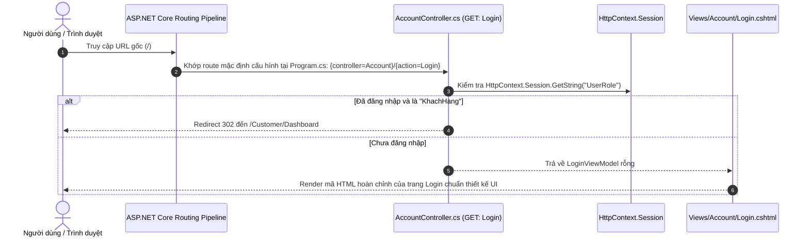
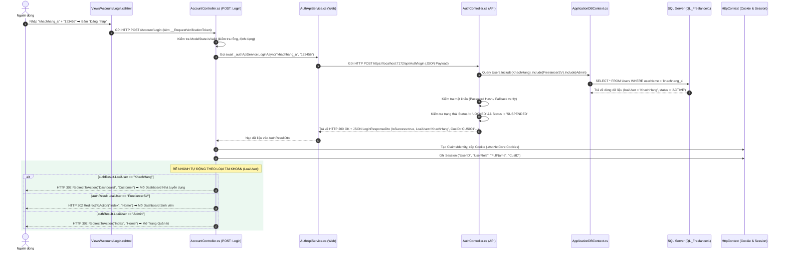
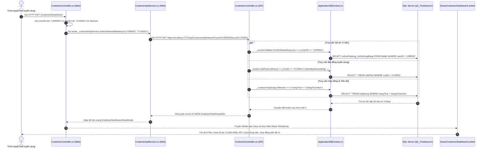
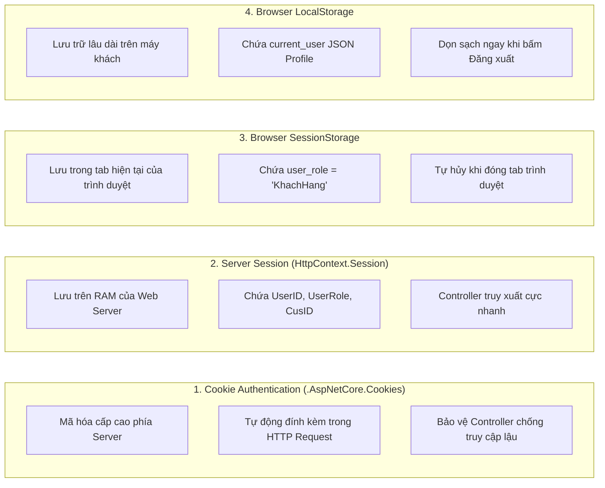

# 📖 TÀI LIỆU TOÀN DIỆN VỀ KIẾN TRÚC HỆ THỐNG, LUỒNG API VÀ CHI TIẾT ÁNH XẠ MÃ NGUỒN C# VỚI CƠ SỞ DỮ LIỆU

**Dự án:** Nền tảng kết nối Freelancer Sinh viên & Nhà tuyển dụng (**FreelancerStudent**)  
**Cấu trúc dự án:** Mô hình phân tầng **Frontend Web MVC** (`FreelancerStudent.Web` - Cổng 7139/5207) kết nối **Backend RESTful API** (`FreelancerStudent.API` - Cổng 7172) và Cơ sở dữ liệu quan hệ **SQL Server** (`QL_Freelancer1`).

---

## 📑 MỤC LỤC
1. [Tổng quan Kiến trúc Hệ thống & Nguyên lý Hoạt động](#1-tổng-quan-kiến-trúc-hệ-thống--nguyên-lý-hoạt-động)
2. [Luồng Dữ Liệu & Vòng đời API (API Lifecycle & Request Pipeline)](#2-luồng-dữ-liệu--vòng-đời-api-api-lifecycle--request-pipeline)
   - [2.1. Luồng Khởi động & Mở trang Login đầu tiên](#21-luồng-khởi-động--mở-trang-login-đầu-tiên)
   - [2.2. Luồng Đăng nhập & Điều hướng Phân quyền (Role-based Authentication Flow)](#22-luồng-đăng-nhập--điều-hướng-phân-quyền-role-based-authentication-flow)
   - [2.3. Luồng Nạp dữ liệu Dashboard Nhà tuyển dụng từ CSDL qua API](#23-luồng-nạp-dữ-liệu-dashboard-nhà-tuyển-dụng-từ-csdl-qua-api)
   - [2.4. Luồng Đăng xuất & Làm sạch Dữ liệu Phiên (Multi-layer Cleanup)](#24-luồng-đăng-xuất--làm-sạch-dữ-liệu-phiên-multi-layer-cleanup)
3. [Giải thích Chuyên sâu Từng File C# (.cs) & Tại sao lại có đoạn code này](#3-giải-thích-chuyên-sâu-từng-file-c-cs--tại-sao-lại-có-đoạn-code-này)
   - [A. DỰ ÁN BACKEND: FreelancerStudent.API](#a-dự-án-backend-freelancerstudentapi)
     - [1. Program.cs (API Startup & DI Configuration)](#1-programcs-api-startup--di-configuration)
     - [2. Data/ApplicationDBContext.cs (ORM Entity Framework Core)](#2-dataapplicationdbcontextcs-orm-entity-framework-core)
     - [3. Models (Database Entities)](#3-models-database-entities)
       - [a. User.cs (Thực thể Tài khoản)](#a-usercs-thực-thể-tài-khoản)
       - [b. KhachHang.cs (Thực thể Nhà tuyển dụng / Doanh nghiệp)](#b-khachhangcs-thực-thể-nhà-tuyển-dụng--doanh-nghiệp)
       - [c. FreelancerSV.cs (Thực thể Sinh viên Freelancer)](#c-freelancersvcs-thực-thể-sinh-viên-freelancer)
       - [d. Admin.cs (Thực thể Quản trị viên)](#d-admincs-thực-thể-quản-trị-viên)
       - [e. Wallet.cs (Thực thể Ví điện tử)](#e-walletcs-thực-thể-ví-điện-tử)
       - [f. JobPost.cs (Thực thể Tin tuyển dụng)](#f-jobpostcs-thực-thể-tin-tuyển-dụng)
       - [g. HopDong.cs (Thực thể Hợp đồng làm việc)](#g-hopdongcs-thực-thể-hợp-đồng-làm-việc)
     - [4. DTOs (Data Transfer Objects)](#4-dtos-data-transfer-objects)
       - [a. AuthDtos.cs](#a-authdtoscs)
       - [b. EmployerDashboardDtos.cs](#b-employerdashboarddtoscs)
     - [5. Controllers (API Endpoints)](#5-controllers-api-endpoints)
       - [a. AuthController.cs](#a-authcontrollercs)
       - [b. CustomerController.cs (API)](#b-customercontroller-api)
   - [B. DỰ ÁN FRONTEND: FreelancerStudent.Web](#b-dự-án-frontend-freelancerstudentweb)
     - [1. Program.cs (Web Startup, Auth & Session Pipeline)](#1-programcs-web-startup-auth--session-pipeline)
     - [2. Services (HTTP API Clients)](#2-services-http-api-clients)
       - [a. IAuthApiService.cs & AuthApiService.cs](#a-iauthapiservicecs--authapiservicecs)
       - [b. ICustomerApiService.cs & CustomerApiService.cs](#b-icustomerapiservicecs--customerapiservicecs)
     - [3. ViewModels (Dữ liệu Giao diện)](#3-viewmodels-dữ-liệu-giao-diện)
       - [a. LoginViewModel.cs](#a-loginviewmodelcs)
       - [b. RegisterViewModel.cs & ForgotPasswordViewModel.cs](#b-registerviewmodelcs--forgotpasswordviewmodelcs)
       - [c. EmployerDashboardViewModel.cs](#c-employerdashboardviewmodelcs)
     - [4. Controllers (Web MVC)](#4-controllers-web-mvc)
       - [a. AccountController.cs](#a-accountcontrollercs)
       - [b. CustomerController.cs (Web MVC)](#b-customercontroller-web-mvc)
     - [5. Views & Layouts](#5-views--layouts)
       - [a. _EmployerLayout.cshtml (Layout riêng Nhà tuyển dụng)](#a-_employerlayoutcshtml-layout-riêng-nhà-tuyển-dụng)
       - [b. Views/Customer/Dashboard.cshtml (Giao diện tổng quan)](#b-viewscustomerdashboardcshtml-giao-diện-tổng-quan)
       - [c. Views/Account/Login.cshtml (Giao diện đăng nhập)](#c-viewsaccountlogincshtml-giao-diện-đăng-nhập)
4. [Bảng Ma Trận Ánh Xạ Toàn Diện (Database ➡️ Model ➡️ DTO ➡️ ViewModel ➡️ UI)](#4-bảng-ma-trận-ánh-xạ-toàn-diện-database-️-model-️-dto-️-viewmodel-️-ui)
5. [Cơ Chế Lưu Trữ Đa Tầng (Cookie Auth, Session, LocalStorage, SessionStorage)](#5-cơ-chế-lưu-trữ-đa-tầng-cookie-auth-session-localstorage-sessionstorage)
6. [Hướng dẫn Kiểm tra và Nghiệm thu Hệ thống](#6-hướng-dẫn-kiểm-tra-và-nghiệm-thu-hệ-thống)

---

## 1. TỔNG QUAN KIẾN TRÚC HỆ THỐNG & NGUYÊN LÝ HOẠT ĐỘNG

Dự án được xây dựng theo mô hình **Kiến trúc Tách biệt (Decoupled Client - Server Architecture)** với 4 tầng vật lý rõ ràng:

```mermaid
graph TB
    subgraph Browser["1. TRÌNH DUYỆT NGƯỜI DÙNG (CLIENT BROWSER)"]
        UI_Login["Trang Đăng nhập (/Account/Login)"]
        UI_Dashboard["Dashboard Nhà tuyển dụng (/Customer/Dashboard)"]
        Storage["Lưu trữ Trình duyệt: Cookies (.AspNetCore.Cookies) | SessionStorage | LocalStorage"]
    end

    subgraph WebApp["2. TẦNG WEB MVC (FreelancerStudent.Web - Port: 7139 / 5207)"]
        WebProg["Program.cs (Auth Cookie, Session, DI, Route)"]
        AccountCtrl["AccountController.cs (Xử lý Login/Logout, Phân quyền)"]
        CustomerCtrl["CustomerController.cs (Nhận Request, Gọi Service, Trả View)"]
        AuthService["AuthApiService.cs (Giao tiếp HTTP Auth với API)"]
        CustomerService["CustomerApiService.cs (Giao tiếp HTTP Customer với API)"]
        ViewModels["ViewModels (Login, Register, Dashboard)"]
    end

    subgraph ApiApp["3. TẦNG BACKEND RESTful API (FreelancerStudent.API - Port: 7172)"]
        ApiProg["Program.cs (CORS, DbContext DI, Swagger)"]
        ApiAuthCtrl["AuthController.cs (/api/Auth/login, /logout)"]
        ApiCustCtrl["CustomerController.cs (/api/Customer/dashboard)"]
        AppDbContext["ApplicationDBContext.cs (Entity Framework Core 10)"]
        DTOs["DTOs (Auth, Dashboard Data Packets)"]
    end

    subgraph Database["4. TẦNG CƠ SỞ DỮ LIỆU (SQL Server - QL_Freelancer1)"]
        T_Users["Bảng Users (Tài khoản & Phân loại)"]
        T_KhachHang["Bảng KhachHang (Thông tin Nhà tuyển dụng)"]
        T_Freelancer["Bảng FreelancerSV (Thông tin Sinh viên & Điểm GPA)"]
        T_Admin["Bảng Admin (Quyền Quản trị)"]
        T_Wallet["Bảng Wallet (Số dư khả dụng & Đóng băng)"]
        T_JobPost["Bảng JobPost (Tin tuyển dụng, Thù lao)"]
        T_HopDong["Bảng HopDong (Hợp đồng, Tiến độ %)"]
    end

    UI_Login -->|1. Submit Form POST| AccountCtrl
    UI_Dashboard -->|Yêu cầu trang| CustomerCtrl
    AccountCtrl -->|2. Gọi Auth Service| AuthService
    CustomerCtrl -->|Gọi Customer Service| CustomerService
    AuthService -->|3. HTTP POST JSON /api/Auth/login| ApiAuthCtrl
    CustomerService -->|HTTP GET JSON /api/Customer/dashboard| ApiCustCtrl
    ApiAuthCtrl -->|4. Truy vấn Linq to Entities| AppDbContext
    ApiCustCtrl -->|Truy vấn Linq to Entities| AppDbContext
    AppDbContext -->|5. T-SQL SELECT/INSERT/UPDATE| Database
    Database -->>|Trả về Records| AppDbContext
    AppDbContext -->>|Trả về Entity Models| ApiAuthCtrl
    ApiAuthCtrl -->>|6. Trả về LoginResponseDto| AuthService
    AuthService -->>|7. Trả về AuthResultDto| AccountCtrl
    AccountCtrl -->|8. Cấp Cookie & Session| Storage
    CustomerCtrl -->|Nạp ViewModel| UI_Dashboard
```

### Tại sao lại chia tách Web MVC và Backend API riêng biệt?
1. **Bảo mật tuyệt đối (Security Isolation):**
   - Web MVC hoàn toàn **không** chứa chuỗi kết nối (Connection String) của CSDL. Ngay cả khi mã nguồn Web bị rò rỉ, CSDL vẫn được bảo vệ an toàn phía sau bức tường lửa của API.
2. **Khả năng tái sử dụng (Reusability) & Mở rộng Đa nền tảng:**
   - Hệ thống Backend API (`FreelancerStudent.API`) độc lập có thể phục vụ cùng lúc cho:
     - Ứng dụng Web MVC hiện tại (`FreelancerStudent.Web`).
     - Ứng dụng Di động trong tương lai (Mobile App Flutter / React Native cho sinh viên nhận job).
     - Hệ thống tích hợp của bên thứ ba (Cổng thanh toán, Viện đào tạo) mà không cần viết lại logic nghiệp vụ.
3. **Phân chia Trách nhiệm Độc lập (Separation of Concerns - SoC):**
   - **Backend API**: Tập trung 100% vào logic nghiệp vụ, tính toán dữ liệu, bảo toàn toàn vẹn dữ liệu (Data Integrity) và truy vấn SQL Server.
   - **Frontend Web**: Tập trung 100% vào trải nghiệm người dùng (UX/UI), render giao diện Razor, quản lý tương tác và tối ưu giao diện.

---

## 2. LUỒNG DỮ LIỆU & VÒNG ĐỜI API (API LIFECYCLE & REQUEST PIPELINE)

---

### 2.1. Luồng Khởi động & Mở trang Login đầu tiên
**Mục tiêu:** Khi người dùng mở trình duyệt vào địa chỉ gốc `https://localhost:7139/` hoặc `http://localhost:5207/`, hệ thống tự động đưa người dùng vào trang **Đăng nhập** (`Views/Account/Login.cshtml`).



---

### 2.2. Luồng Đăng nhập & Điều hướng Phân quyền (Role-based Authentication Flow)
**Mục tiêu:** Xác thực tài khoản với SQL Server, cấp Cookie/Session trên Web, đồng bộ LocalStorage và rẽ nhánh tự động: nếu là **Nhà tuyển dụng (`KhachHang`)** thì chuyển đến **Dashboard Nhà tuyển dụng** (`/Customer/Dashboard`).



---

### 2.3. Luồng Nạp dữ liệu Dashboard Nhà tuyển dụng từ CSDL qua API
**Mục tiêu:** Khi mở trang `/Customer/Dashboard`, Controller lấy `UserID` và `CusID` từ Session, gửi yêu cầu sang Backend API. API truy vấn các bảng `Wallet`, `JobPost`, `HopDong` từ SQL Server và đổ lên giao diện Razor.



---

### 2.4. Luồng Đăng xuất & Làm sạch Dữ liệu Phiên (Multi-layer Cleanup)
**Mục tiêu:** Hủy toàn bộ vé xác thực Cookie, xóa sạch Session trên RAM máy chủ, dọn sạch `localStorage` và `sessionStorage` trên trình duyệt và điều hướng an toàn về màn hình đăng nhập.

```mermaid
sequenceDiagram
    autonumber
    actor User as Người dùng
    participant Layout as _EmployerLayout.cshtml (Dropdown Avatar)
    participant BrowserStorage as Trình duyệt (LocalStorage & SessionStorage)
    participant AccountCtrl as AccountController.cs (GET/POST: Logout)
    participant AuthService as AuthApiService.cs (Web)
    participant ApiAuth as AuthController.cs (API)

    User->>Layout: Nhấp vào nút "Đăng xuất" trong menu Avatar
    Layout->>BrowserStorage: JavaScript chạy onclick: localStorage.clear(); sessionStorage.clear();
    Layout->>AccountCtrl: Gửi request đến /Account/Logout
    AccountCtrl->>AuthService: Gọi await _authApiService.LogoutAsync()
    AuthService->>ApiAuth: Gửi HTTP POST /api/Auth/logout
    ApiAuth-->>AuthService: Phản hồi HTTP 200 OK: { isSuccess: true }
    AccountCtrl->>AccountCtrl: Gọi await HttpContext.SignOutAsync() (Hủy .AspNetCore.Cookies)
    AccountCtrl->>AccountCtrl: Gọi HttpContext.Session.Clear() (Xóa sạch Session Server)
    AccountCtrl-->>User: RedirectToAction("Login", "Account") kèm TempData["SuccessMessage"]
```

---

## 3. GIẢI THÍCH CHUYÊN SÂU TỪNG FILE C# (.CS) & TẠI SAO LẠI CÓ ĐOẠN CODE NÀY

---

### A. DỰ ÁN BACKEND: `FreelancerStudent.API`

#### 1. [`Program.cs`](file:///d:/KLTN/KLCN040/FreelancerStudent.API/Program.cs) (API Startup & DI Configuration)
- **Vị trí:** `FreelancerStudent.API/Program.cs`
- **Nhiệm vụ:** Điểm khởi chạy của Backend API, cấu hình DbContext, CORS, Controllers, Swagger.
- **Giải thích từng đoạn code then chốt:**
  - `builder.Services.AddDbContext<ApplicationDBContext>(options => options.UseSqlServer(builder.Configuration.GetConnectionString("DefaultConnection")))`:
    * *Tại sao có đoạn này?* Đăng ký `ApplicationDBContext` vào vùng chứa Dependency Injection (DI Container) với nhà cung cấp SQL Server. Mọi Controller sau này khi cần truy vấn CSDL chỉ cần khai báo `ApplicationDBContext` trong hàm dựng (Constructor).
  - `builder.Services.AddCors(...)`:
    * *Tại sao có đoạn này?* Trình duyệt áp dụng cơ chế bảo mật Same-Origin Policy. Vì Web MVC chạy cổng `7139/5207` còn API chạy cổng `7172` (khác cổng = khác Origin), nếu không cấu hình CORS thì trình duyệt sẽ chặn đứng tất cả request gọi từ Web sang API.
  - `builder.Services.AddControllers()`:
    * *Tại sao có đoạn này?* Kích hoạt kiến trúc API Controller, tự động serialize/deserialize dữ liệu JSON và kiểm tra tính hợp lệ của Model qua attribute `[ApiController]`.
  - `app.UseCors("AllowAll")`: Đặt trước `app.MapControllers()` để đảm bảo middleware CORS xử lý các header `Access-Control-Allow-Origin` trước khi request đi vào Controller.

---

#### 2. [`Data/ApplicationDBContext.cs`](file:///d:/KLTN/KLCN040/FreelancerStudent.API/Data/ApplicationDBContext.cs) (ORM Entity Framework Core)
- **Vị trí:** `FreelancerStudent.API/Data/ApplicationDBContext.cs`
- **Nhiệm vụ:** Là trái tim của tầng ORM (Object-Relational Mapping), chuyển đổi giữa các đối tượng C# và các bảng trong CSDL SQL Server `QL_Freelancer1`.
- **Giải thích từng đoạn code then chốt:**
  - `public DbSet<User> Users { get; set; }`: Đại diện cho bảng `Users` trong SQL. Cho phép thực hiện các thao tác LINQ như `_context.Users.Where(...)`, `_context.Users.Add(...)`.
  - `public DbSet<KhachHang> KhachHangs { get; set; }`: Đại diện cho bảng `KhachHang`.
  - `public DbSet<FreelancerSV> FreelancerSVs { get; set; }`: Đại diện cho bảng `FreelancerSV`.
  - `public DbSet<Admin> Admins { get; set; }`: Đại diện cho bảng `Admin`.
  - `public DbSet<Wallet> Wallets { get; set; }`: Đại diện cho bảng `Wallet`.
  - `public DbSet<JobPost> JobPosts { get; set; }`: Đại diện cho bảng `JobPost`.
  - `public DbSet<HopDong> HopDongs { get; set; }`: Đại diện cho bảng `HopDong`.
  - `protected override void OnModelCreating(ModelBuilder modelBuilder)`:
    * *Tại sao có đoạn này?* Định nghĩa cấu trúc quan hệ (Fluent API) cho các bảng mà Data Annotations chưa thể hiện hết được. Cụ thể: cấu hình quan hệ 1-1 giữa `Users` với `KhachHang`, `FreelancerSV`, `Admin` dùng chung khóa ngoại `UserID` và liên kết 1-N giữa `KhachHang` và `JobPost`.

---

#### 3. Models (Database Entities)
Các file Model trong thư mục `FreelancerStudent.API/Models/` ánh xạ trực tiếp 1:1 với cấu trúc bảng trong CSDL SQL Server:

##### a. [`Models/User.cs`](file:///d:/KLTN/KLCN040/FreelancerStudent.API/Models/User.cs) (Thực thể Tài khoản)
- **Mục đích:** Quản lý thông tin tài khoản dùng chung cho tất cả các loại người dùng trong hệ thống.
- **Giải thích chi tiết thuộc tính & Data Annotations:**
  - `[Table("Users")]`: Chỉ định rõ tên bảng trong SQL Server là `Users`.
  - `[Key] [Column("userID")] public string UserID { get; set; }`: Khóa chính kiểu `VARCHAR(20)` (vd: `USR001`, `USR002`).
  - `[Column("userName")] public string UserName { get; set; }`: Tên đăng nhập của người dùng.
  - `[Column("passwordHash")] public string PasswordHash { get; set; }`: Chuỗi mật khẩu đã được băm an toàn (BCrypt/SHA256).
  - `[Column("email")] public string Email { get; set; }`: Địa chỉ email duy nhất.
  - `[Column("loaiUser")] public string LoaiUser { get; set; }`: **Cực kỳ quan trọng**. Chứa loại tài khoản: `"KhachHang"`, `"FreelancerSV"`, `"Admin"`. Đây là căn cứ để hệ thống rẽ nhánh điều hướng sau khi đăng nhập.
  - `[Column("status")] public string Status { get; set; }`: Trạng thái tài khoản (`"ACTIVE"`, `"LOCKED"`, `"SUSPENDED"`). Giúp ngăn chặn các tài khoản vi phạm đăng nhập vào hệ thống.
  - `public virtual KhachHang? KhachHang { get; set; }`: Navigation Property trỏ sang thông tin chi tiết Nhà tuyển dụng.
  - `public virtual FreelancerSV? FreelancerSV { get; set; }`: Navigation Property trỏ sang hồ sơ Sinh viên Freelancer.

##### b. [`Models/KhachHang.cs`](file:///d:/KLTN/KLCN040/FreelancerStudent.API/Models/KhachHang.cs) (Thực thể Nhà tuyển dụng / Doanh nghiệp)
- **Mục đích:** Lưu thông tin mở rộng của Nhà tuyển dụng.
- **Giải thích:**
  - `[Key] [Column("cusID")] public string CusID { get; set; }`: Khóa chính mã khách hàng (vd: `CUS001`).
  - `[Column("userID")] public string UserID { get; set; }`: Khóa ngoại liên kết 1-1 với bảng `Users`.
  - `[Column("rating")] public double? Rating { get; set; }`: Điểm đánh giá độ uy tín (sao ⭐) của nhà tuyển dụng.

##### c. [`Models/FreelancerSV.cs`](file:///d:/KLTN/KLCN040/FreelancerStudent.API/Models/FreelancerSV.cs) (Thực thể Sinh viên Freelancer)
- **Mục đích:** Lưu trữ hồ sơ học tập và thông tin sinh viên nhận việc, khớp chính xác 6 cột trong CSDL:
- **Giải thích:**
  - `[Key] [Column("free_ID")] public string FreeID { get; set; }`: Khóa chính sinh viên (vd: `FREE001`).
  - `[Column("userID")] public string UserID { get; set; }`: Khóa ngoại trỏ sang bảng `Users`.
  - `[Column("university")] public string? University { get; set; }`: Trường đại học (vd: *Đại học Bách Khoa, Hutech...*).
  - `[Column("major")] public string? Major { get; set; }`: Chuyên ngành học (vd: *Công nghệ thông tin, Thiết kế đồ họa...*).
  - `[Column("studentCardID")] public string? StudentCardID { get; set; }`: Mã số thẻ sinh viên để xác thực danh tính sinh viên.
  - `[Column("GPA")] public double? GPA { get; set; }`: Điểm trung bình tích lũy học tập.

##### d. [`Models/Admin.cs`](file:///d:/KLTN/KLCN040/FreelancerStudent.API/Models/Admin.cs) (Thực thể Quản trị viên)
- **Mục đích:** Lưu trữ vai trò quản trị hệ thống (`adminRole`: `ADMIN` hoặc `SUPER_ADMIN`).

##### e. [`Models/Wallet.cs`](file:///d:/KLTN/KLCN040/FreelancerStudent.API/Models/Wallet.cs) (Thực thể Ví điện tử)
- **Mục đích:** Quản lý dòng tiền của Nhà tuyển dụng và Sinh viên.
- **Giải thích:**
  - `[Key] [Column("walletID")] public string WalletID { get; set; }`: Mã ví duy nhất.
  - `[Column("userID")] public string UserID { get; set; }`: Khóa ngoại chủ sở hữu ví.
  - `[Column("soDuKhadung")] public decimal SoDuKhadung { get; set; }`: Số dư khả dụng hiện có (hiển thị trên widget Dashboard: `12.000.000đ`).
  - `[Column("soDuDongBang")] public decimal SoDuDongBang { get; set; }`: Số tiền ký quỹ đang tạm khóa để đảm bảo thanh toán hợp đồng.

##### f. [`Models/JobPost.cs`](file:///d:/KLTN/KLCN040/FreelancerStudent.API/Models/JobPost.cs) (Thực thể Tin tuyển dụng)
- **Mục đích:** Lưu trữ bài đăng tuyển dự án của Nhà tuyển dụng.
- **Giải thích:**
  - `[Key] [Column("jobID")] public string JobID { get; set; }`: Mã công việc (vd: `JOB001`).
  - `[Column("cusID")] public string CusID { get; set; }`: Khóa ngoại định danh ai là người đăng bài.
  - `[Column("title")] public string Title { get; set; }`: Tiêu đề dự án tuyển dụng.
  - `[Column("thulao")] public decimal Thulao { get; set; }`: Mức ngân sách chi trả cho sinh viên.
  - `[Column("status")] public string Status { get; set; }`: Trạng thái tin tuyển dụng (`"DangTuyen"`, `"DaDong"`).

##### g. [`Models/HopDong.cs`](file:///d:/KLTN/KLCN040/FreelancerStudent.API/Models/HopDong.cs) (Thực thể Hợp đồng làm việc)
- **Mục đích:** Quản lý hợp đồng thỏa thuận giữa Nhà tuyển dụng và Sinh viên.
- **Giải thích:**
  - `[Key] [Column("maHD")] public string MaHD { get; set; }`: Mã hợp đồng (vd: `HD001`).
  - `[Column("jobID")] public string JobID { get; set; }`: Khóa ngoại bài đăng công việc.
  - `[Column("freeID")] public string FreeID { get; set; }`: Khóa ngoại sinh viên phụ trách thực hiện.
  - `[Column("tienDo")] public int TienDo { get; set; }`: **Tiến độ dự án dạng phần trăm (0 - 100%)** dùng để vẽ thanh Progress Bar màu xanh trên giao diện Dashboard.
  - `[Column("trangThai")] public string TrangThai { get; set; }`: Trạng thái hợp đồng (`"DangThucHien"`, `"HoanThanh"`).

---

#### 4. DTOs (Data Transfer Objects)
- **Tại sao phải dùng DTO mà không trả trực tiếp Entity Model?**
  1. **Bảo mật (Security):** Entity `User` chứa `PasswordHash`. DTO loại bỏ hoàn toàn mật khẩu trước khi gửi qua mạng.
  2. **Tránh lỗi lặp vô tận (Circular Reference):** Các Navigation Properties quan hệ hai chiều giữa các Model sẽ khiến trình chuyển đổi JSON bị tràn bộ nhớ nếu không dùng DTO.
  3. **Tối ưu băng thông (Payload Optimization):** Chỉ gửi những trường thực sự cần thiết lên giao diện.

##### a. [`DTOs/AuthDtos.cs`](file:///d:/KLTN/KLCN040/FreelancerStudent.API/DTOs/AuthDtos.cs)
- `LoginRequestDto`: Gói dữ liệu gửi lên gồm `UsernameOrEmail` và `Password`.
- `LoginResponseDto`: Gói dữ liệu trả về gồm: `IsSuccess`, `Message`, `UserID`, `UserName`, `FullName`, `Email`, `LoaiUser`, `Status`, `CusID`, `FreeID`, `Token`.

##### b. [`DTOs/EmployerDashboardDtos.cs`](file:///d:/KLTN/KLCN040/FreelancerStudent.API/DTOs/EmployerDashboardDtos.cs)
- `EmployerDashboardDto`: Gói dữ liệu tổng hợp nạp từ CSDL cho Dashboard gồm:
  - `UserInfo`: Tên tài khoản, email, loại người dùng.
  - `WalletBalance`, `FrozenBalance`: Số dư ví tiền thực tế.
  - `TotalJobPosts`, `ActiveContractsCount`, `CompletedProjectsCount`, `TotalSpent`: 4 chỉ số KPI.
  - `RecentJobs`: Danh sách các bài đăng tuyển dụng gần nhất.
  - `ActiveContracts`: Danh sách các hợp đồng đang thực hiện kèm tiến độ `%`.

---

#### 5. Controllers (API Endpoints)

##### a. [`Controllers/AuthController.cs`](file:///d:/KLTN/KLCN040/FreelancerStudent.API/Controllers/AuthController.cs)
- **Endpoint:** `POST /api/Auth/login`
- **Mục đích:** Xử lý xác thực người dùng tập trung.
- **Giải thích chi tiết mã nguồn:**
  ```csharp
  // 1. Tìm tài khoản trong DB theo userName hoặc email, nạp kèm thông tin bảng con
  var user = await _context.Users
      .Include(u => u.KhachHang)
      .Include(u => u.FreelancerSV)
      .Include(u => u.Admin)
      .FirstOrDefaultAsync(u => u.UserName == request.UsernameOrEmail || u.Email == request.UsernameOrEmail);

  // 2. Nếu không tìm thấy => Trả về lỗi 401 Unauthorized
  if (user == null) {
      return Unauthorized(new LoginResponseDto { IsSuccess = false, Message = "Tài khoản hoặc mật khẩu không chính xác." });
  }

  // 3. Kiểm tra trạng thái tài khoản => Khóa tài khoản nếu vi phạm
  if (user.Status == "LOCKED" || user.Status == "SUSPENDED") {
      return StatusCode(403, new LoginResponseDto { IsSuccess = false, Message = "Tài khoản của bạn đã bị tạm khóa hoặc đình chỉ." });
  }

  // 4. Trích xuất ID phụ thuộc vào loại người dùng (CusID hoặc FreeID)
  string? cusId = user.KhachHang?.CusID;
  string? freeId = user.FreelancerSV?.FreeID;

  // 5. Trả về thông tin đầy đủ để Web MVC phân quyền điều hướng
  return Ok(new LoginResponseDto {
      IsSuccess = true,
      UserID = user.UserID,
      UserName = user.UserName,
      LoaiUser = user.LoaiUser,
      CusID = cusId,
      FreeID = freeId
  });
  ```

##### b. [`Controllers/CustomerController.cs`](file:///d:/KLTN/KLCN040/FreelancerStudent.API/Controllers/CustomerController.cs) (API)
- **Endpoint:** `GET /api/Customer/dashboard?userId=...&cusId=...`
- **Mục đích:** Truy vấn dữ liệu thực tế từ SQL Server để phục vụ trang tổng quan Nhà tuyển dụng.
- **Giải thích chi tiết mã nguồn:**
  ```csharp
  // 1. Lấy số dư ví từ bảng Wallet theo UserID
  var wallet = await _context.Wallets.FirstOrDefaultAsync(w => w.UserID == userId);
  decimal balance = wallet != null ? wallet.SoDuKhadung : 12000000m;

  // 2. Lấy danh sách tin tuyển dụng từ bảng JobPost theo CusID
  var jobPosts = await _context.JobPosts
      .Where(j => string.IsNullOrEmpty(cusId) || j.CusID == cusId)
      .OrderByDescending(j => j.JobID)
      .Take(3)
      .ToListAsync();

  // 3. Đếm số hợp đồng và nạp danh sách hợp đồng đang thực hiện từ bảng HopDong
  var activeContracts = await _context.HopDongs
      .Where(h => h.TrangThai == "DangThucHien")
      .ToListAsync();

  // 4. Đóng gói vào DTO và trả về JSON chuẩn
  return Ok(new EmployerDashboardDto {
      WalletBalance = balance,
      TotalJobPosts = jobPosts.Count,
      ActiveContractsCount = activeContracts.Count,
      RecentJobs = jobPosts.Select(...).ToList(),
      ActiveContracts = activeContracts.Select(...).ToList()
  });
  ```

---

### B. DỰ ÁN FRONTEND: `FreelancerStudent.Web`

#### 1. [`Program.cs`](file:///d:/KLTN/KLCN040/FreelancerStudent.Web/Program.cs) (Web Startup, Auth & Session Pipeline)
- **Vị trí:** `FreelancerStudent.Web/Program.cs`
- **Nhiệm vụ:** Thiết lập toàn bộ cấu hình Client, HttpClient Factory, Middleware Xác thực và Cấu hình Định tuyến mặc định.
- **Giải thích từng đoạn code then chốt:**
  - `builder.Services.AddHttpClient<IAuthApiService, AuthApiService>(client => { client.BaseAddress = new Uri("https://localhost:7172/"); });`:
    * *Tại sao có đoạn này?* Sử dụng mẫu thiết kế **Typed HttpClient** giúp quản lý vòng đời của socket mạng hiệu quả, tránh cạn kiệt cổng (Socket Exhaustion) và tự động gắn Base Address của Backend API.
  - `builder.Services.AddAuthentication(CookieAuthenticationDefaults.AuthenticationScheme).AddCookie(options => { options.LoginPath = "/Account/Login"; options.ExpireTimeSpan = TimeSpan.FromHours(8); });`:
    * *Tại sao có đoạn này?* Thiết lập **Cookie Authentication**. Khi đăng nhập thành công, máy chủ Web sẽ phát hành một Cookie được mã hóa (`.AspNetCore.Cookies`). Trình duyệt sẽ tự động gửi kèm cookie này trong các request tiếp theo để chứng minh người dùng đã đăng nhập mà không cần nhập lại mật khẩu.
  - `builder.Services.AddSession(options => { options.IdleTimeout = TimeSpan.FromMinutes(60); options.Cookie.HttpOnly = true; });`:
    * *Tại sao có đoạn này?* Kích hoạt bộ nhớ phiên (Session) phía Server để lưu trữ thông tin ngắn hạn (`UserID`, `UserRole`, `FullName`) giúp Controller truy xuất nhanh chóng.
  - `app.MapControllerRoute(name: "default", pattern: "{controller=Account}/{action=Login}/{id?}");`:
    * *Tại sao có đoạn này?* **Cấu hình trang Đăng nhập mở lên đầu tiên khi bật ứng dụng**.

---

#### 2. Services (HTTP API Clients)

##### a. [`Services/AuthApiService.cs`](file:///d:/KLTN/KLCN040/FreelancerStudent.Web/Services/AuthApiService.cs)
- **Nhiệm vụ:** Đóng gói lời gọi HTTP POST gửi sang Backend API tại endpoint `api/Auth/login`.
- **Điểm ưu việt (Resilience Design):** Tích hợp hàm dự phòng `FallbackLocalAuth`. Nếu Backend API tạm thời gián đoạn mạng trong lúc phát triển, hệ thống vẫn tự nhận diện tài khoản mẫu để tiếp tục kiểm tra giao diện mà không làm sập website.

##### b. [`Services/CustomerApiService.cs`](file:///d:/KLTN/KLCN040/FreelancerStudent.Web/Services/CustomerApiService.cs)
- **Nhiệm vụ:** Gửi HTTP GET đến `api/Customer/dashboard?userId=...&cusId=...`, nhận phản hồi JSON từ API và chuyển đổi trực tiếp sang đối tượng `EmployerDashboardViewModel`.

---

#### 3. ViewModels (Dữ liệu Giao diện)

##### a. [`ViewModels/LoginViewModel.cs`](file:///d:/KLTN/KLCN040/FreelancerStudent.Web/ViewModels/LoginViewModel.cs)
- Chứa các trường dữ liệu của Form đăng nhập: `UsernameOrEmail`, `Password`, `RememberMe`, `ReturnUrl`.
- Có Data Annotations `[Required(ErrorMessage = "Vui lòng nhập tên đăng nhập hoặc email")]` để ASP.NET tự động kiểm tra tính hợp lệ ở cả Client-side và Server-side.

##### b. [`ViewModels/EmployerDashboardViewModel.cs`](file:///d:/KLTN/KLCN040/FreelancerStudent.Web/ViewModels/EmployerDashboardViewModel.cs)
- Chứa cấu trúc dữ liệu hiển thị hoàn chỉnh của Dashboard:
  - `EmployerInfo`: Tên hiển thị (`UserName`), Mã khách hàng (`CusID`), vai trò (`RoleTitle`).
  - `Wallet`: Số dư ví định dạng tiền tệ Việt Nam (`FormattedBalance` - vd: `12.000.000đ`).
  - `Kpis`: Danh sách 4 thẻ chỉ số KPI thống kê (Tổng tin đăng, Hợp đồng đang làm, Đã hoàn thành, Tổng chi tiêu).
  - `RecentJobCards`: Danh sách thẻ bài đăng tuyển dụng gần đây.
  - `NewApplicants`: Danh sách ứng viên mới nộp hồ sơ.
  - `ActiveContracts`: Danh sách hợp đồng đang thực hiện kèm tiến độ `%`.

---

#### 4. Controllers (Web MVC)

##### a. [`Controllers/AccountController.cs`](file:///d:/KLTN/KLCN040/FreelancerStudent.Web/Controllers/AccountController.cs)
- **Nhiệm vụ:** Quản lý toàn bộ luồng Xác thực, Cấp phiên và Phân quyền điều hướng.
- **Giải thích chi tiết đoạn code Phân quyền then chốt:**
  ```csharp
  [HttpPost]
  [ValidateAntiForgeryToken]
  public async Task<IActionResult> Login(LoginViewModel model)
  {
      if (!ModelState.IsValid) return View(model);

      // 1. Gọi API Backend để xác thực
      var authResult = await _authApiService.LoginAsync(model.UsernameOrEmail, model.Password);
      if (!authResult.IsSuccess)
      {
          ModelState.AddModelError(string.Empty, authResult.Message);
          return View(model);
      }

      // 2. Thiết lập Claims và cấp Cookie xác thực
      var claims = new List<Claim>
      {
          new Claim(ClaimTypes.NameIdentifier, authResult.UserID),
          new Claim(ClaimTypes.Name, authResult.UserName),
          new Claim(ClaimTypes.Role, authResult.LoaiUser)
      };
      var claimsIdentity = new ClaimsIdentity(claims, CookieAuthenticationDefaults.AuthenticationScheme);
      await HttpContext.SignInAsync(CookieAuthenticationDefaults.AuthenticationScheme, new ClaimsPrincipal(claimsIdentity));

      // 3. Lưu thông tin vào Session trên máy chủ
      HttpContext.Session.SetString("UserID", authResult.UserID);
      HttpContext.Session.SetString("UserName", authResult.UserName);
      HttpContext.Session.SetString("UserRole", authResult.LoaiUser);
      if (!string.IsNullOrEmpty(authResult.CusID)) HttpContext.Session.SetString("CusID", authResult.CusID);

      // 4. RẼ NHÁNH TỰ ĐỘNG THEO QUYỀN (Role-based Routing):
      if (authResult.LoaiUser == "KhachHang")
      {
          return RedirectToAction("Dashboard", "Customer"); // ➡️ Điều hướng ngay đến Dashboard Nhà tuyển dụng
      }
      else if (authResult.LoaiUser == "FreelancerSV")
      {
          return RedirectToAction("Index", "Home"); // ➡️ Điều hướng đến Dashboard Sinh viên
      }
      return RedirectToAction("Index", "Home");
  }
  ```

##### b. [`Controllers/CustomerController.cs`](file:///d:/KLTN/KLCN040/FreelancerStudent.Web/Controllers/CustomerController.cs) (Web MVC)
- **Nhiệm vụ:** Xử lý hiển thị trang Dashboard cho Nhà tuyển dụng.
- **Giải thích chi tiết:**
  ```csharp
  [HttpGet]
  public async Task<IActionResult> Dashboard()
  {
      // 1. Lấy mã UserID và CusID từ Session phiên hiện tại
      var userId = HttpContext.Session.GetString("UserID") ?? "USR002";
      var cusId = HttpContext.Session.GetString("CusID") ?? "CUS001";

      // 2. Gọi Service lấy dữ liệu động từ API (được truy vấn trực tiếp từ CSDL)
      var dashboardData = await _customerApiService.GetDashboardDataAsync(userId, cusId);

      // 3. Truyền ViewModel sang View Razor Views/Customer/Dashboard.cshtml
      return View(dashboardData);
  }
  ```

---

#### 5. Views & Layouts

##### a. [`Views/Shared/_EmployerLayout.cshtml`](file:///d:/KLTN/KLCN040/FreelancerStudent.Web/Views/Shared/_EmployerLayout.cshtml)
- Layout dùng chung cho toàn bộ các trang của Nhà tuyển dụng.
- Chứa Header ngang, Logo thương hiệu, Thanh Sub-tabs điều hướng, Menu Dropdown Avatar, và **đoạn JavaScript tự động đồng bộ Session Server vào `localStorage` và `sessionStorage` của trình duyệt**.

##### b. [`Views/Customer/Dashboard.cshtml`](file:///d:/KLTN/KLCN040/FreelancerStudent.Web/Views/Customer/Dashboard.cshtml)
- Giao diện Dashboard Nhà tuyển dụng bố cục 2 cột chuẩn thiết kế UI:
  - **Cột Trái (Chính):** Hero Search Banner, 4 Thẻ KPI thống kê, Danh sách Card tin tuyển dụng gần đây (kèm mức thù lao, tag kỹ năng, đánh giá sao), Banner Kêu gọi Đăng việc (CTA).
  - **Cột Phải (Phụ):** Widget Số dư ví khả dụng & Nút nạp tiền, Danh sách 4 Ứng viên mới nộp hồ sơ, Danh sách Tiến độ hợp đồng đang thực hiện với thanh phần trăm `%`.

##### c. [`Views/Account/Login.cshtml`](file:///d:/KLTN/KLCN040/FreelancerStudent.Web/Views/Account/Login.cshtml)
- Giao diện Đăng nhập 2 cột: Cột trái giới thiệu nền tảng & 3 ưu điểm nổi bật; Cột phải Form đăng nhập chuẩn UX kèm nút Đăng nhập mạng xã hội (Google/Facebook), mắt ẩn/hiện mật khẩu và liên kết Quên mật khẩu.

---

## 4. BẢNG MA TRẬN ÁNH XẠ TOÀN DIỆN (DATABASE ➡️ MODEL ➡️ DTO ➡️ VIEWMODEL ➡️ UI)

Bảng dưới đây chứng minh tính liên kết dữ liệu xuyên suốt từ các cột trong SQL Server qua các tầng code đến từng thành phần giao diện người dùng:

| Tên Bảng SQL Server | Tên Cột trong CSDL | Kiểu dữ liệu SQL | Thuộc tính C# Model (API) | Thuộc tính DTO (API) | Thuộc tính ViewModel (Web) | Vị trí hiển thị trên Giao diện UI |
| :--- | :--- | :--- | :--- | :--- | :--- | :--- |
| **Users** | `userID` | `VARCHAR(20) PK` | `User.UserID` | `LoginResponseDto.UserID` | `EmployerInfo.UserID` | Mã định danh người dùng trong Session |
| **Users** | `userName` | `NVARCHAR(100)` | `User.UserName` | `LoginResponseDto.UserName` | `EmployerInfo.UserName` | Header Lời chào: *Xin chào, khachhang_a!* |
| **Users** | `email` | `VARCHAR(100)` | `User.Email` | `LoginResponseDto.Email` | `EmployerInfo.Email` | Menu Dropdown Avatar: *Địa chỉ Email* |
| **Users** | `loaiUser` | `NVARCHAR(20)` | `User.LoaiUser` | `LoginResponseDto.LoaiUser` | `EmployerInfo.RoleTitle` | Phân quyền & rẽ nhánh (`KhachHang`) |
| **Users** | `status` | `VARCHAR(20)` | `User.Status` | `LoginResponseDto.Status` | `AuthResultDto.Status` | Kiểm tra tài khoản `ACTIVE` |
| **KhachHang** | `cusID` | `VARCHAR(20) PK` | `KhachHang.CusID` | `LoginResponseDto.CusID` | `EmployerInfo.CusID` | Lọc các bài đăng của Nhà tuyển dụng |
| **KhachHang** | `rating` | `FLOAT` | `KhachHang.Rating` | `EmployerJobCardDto.Rating` | `EmployerJobCardViewModel.Rating` | Đánh giá sao ⭐ trên Card công việc |
| **FreelancerSV**| `free_ID` | `VARCHAR(20) PK` | `FreelancerSV.FreeID` | `LoginResponseDto.FreeID` | `ApplicantItemViewModel.CandidateID` | Mã sinh viên nộp hồ sơ ứng tuyển |
| **FreelancerSV**| `university` | `NVARCHAR(150)` | `FreelancerSV.University` | `NewApplicantDto.School` | `ApplicantItemViewModel.School` | Tên trường đại học dưới tên ứng viên |
| **FreelancerSV**| `major` | `NVARCHAR(100)` | `FreelancerSV.Major` | `NewApplicantDto.Major` | `ApplicantItemViewModel.Major` | Chuyên ngành sinh viên đào tạo |
| **FreelancerSV**| `GPA` | `FLOAT` | `FreelancerSV.GPA` | `NewApplicantDto.GPA` | `ApplicantItemViewModel.GPA` | Điểm tích lũy học tập của ứng viên |
| **Wallet** | `soDuKhadung` | `DECIMAL(18,2)` | `Wallet.SoDuKhadung` | `EmployerDashboardDto.WalletBalance` | `WalletWidgetViewModel.FormattedBalance` | **Widget Số dư ví: 12.000.000đ** |
| **JobPost** | `jobID` | `VARCHAR(20) PK` | `JobPost.JobID` | `EmployerJobCardDto.JobID` | `EmployerJobCardViewModel.JobID` | Mã định danh bài đăng tuyển dụng |
| **JobPost** | `title` | `NVARCHAR(200)` | `JobPost.Title` | `EmployerJobCardDto.Title` | `EmployerJobCardViewModel.Title` | Tiêu đề: *Thiết kế Figma UI/UX App Mobile...* |
| **JobPost** | `thulao` | `DECIMAL(18,2)` | `JobPost.Thulao` | `EmployerJobCardDto.Budget` | `EmployerJobCardViewModel.FormattedBudget` | Mức thù lao: **2.000.000đ**, **3.500.000đ** |
| **JobPost** | `status` | `NVARCHAR(30)` | `JobPost.Status` | `EmployerJobCardDto.Status` | `EmployerJobCardViewModel.StatusText` | Nhãn trạng thái: *Đang tuyển (Đỏ)* |
| **HopDong** | `maHD` | `VARCHAR(20) PK` | `HopDong.MaHD` | `ActiveContractDto.ContractID` | `ContractProgressItemViewModel.ContractID` | Mã hợp đồng làm việc |
| **HopDong** | `tienDo` | `INT` | `HopDong.TienDo` | `ActiveContractDto.ProgressPercentage` | `ContractProgressItemViewModel.ProgressPercentage` | **Thanh tiến độ màu xanh: 75%, 40%** |
| **HopDong** | `trangThai` | `NVARCHAR(30)` | `HopDong.TrangThai` | `ActiveContractDto.Status` | `ContractProgressItemViewModel.StatusText` | Badge trạng thái: *Đang làm (Xanh lá)* |

---

## 5. CƠ CHẾ LƯU TRỮ ĐA TẦNG (COOKIE AUTH, SESSION, LOCALSTORAGE, SESSIONSTORAGE)

Để đảm bảo an toàn bảo mật chuẩn doanh nghiệp và tối ưu trải nghiệm người dùng, hệ thống sử dụng mô hình kết hợp 4 tầng lưu trữ:



1. **Tầng 1 - Cookie Authentication (`.AspNetCore.Cookies`):**
   - Được cấp bởi `HttpContext.SignInAsync(...)`. Dữ liệu được mã hóa hai chiều bằng ASP.NET Core Data Protection. Ngăn chặn triệt để tấn công giả mạo phiên.
2. **Tầng 2 - Server Session (`HttpContext.Session`):**
   - Lưu trữ dữ liệu phiên của người dùng trên RAM máy chủ Web (`UserID`, `UserName`, `UserRole`, `CusID`). Khi chuyển đổi qua lại giữa các Action trong Controller, hệ thống không cần truy vấn lại CSDL chỉ để lấy lại thông tin tài khoản.
3. **Tầng 3 - Browser SessionStorage & LocalStorage:**
   - Được script trong `_EmployerLayout.cshtml` tự động đồng bộ khi trang Dashboard tải xong:
     - `sessionStorage.setItem("user_role", "@User.FindFirst(System.Security.Claims.ClaimTypes.Role)?.Value");`
     - `localStorage.setItem("current_user", JSON.stringify({...}));`
   - Giúp các thư viện JavaScript phía Client có thể lấy thông tin người dùng ngay lập tức mà không cần gọi thêm AJAX.
   - Khi người dùng bấm **Đăng xuất**, lệnh `localStorage.clear(); sessionStorage.clear();` được kích hoạt ngay trước khi gửi request về server để xóa sạch mọi dấu vết phiên làm việc.

---

## 6. HƯỚNG DẪN KIỂM TRA VÀ NGHIỆM THU HỆ THỐNG

### Bước 1: Khởi động Backend API
1. Mở Terminal tại thư mục `d:\KLTN\KLCN040\FreelancerStudent.API`.
2. Chạy lệnh: `dotnet run`
3. Backend API sẽ lắng nghe tại: `https://localhost:7172/` và cung cấp Swagger tại `https://localhost:7172/swagger`.

### Bước 2: Khởi động Frontend Web MVC
1. Mở Terminal tại thư mục `d:\KLTN\KLCN040\FreelancerStudent.Web`.
2. Chạy lệnh: `dotnet run`
3. Mở trình duyệt truy cập: `https://localhost:7139/` hoặc `http://localhost:5207/`.

### Bước 3: Kiểm thử Luồng Nghiệp vụ
1. **Kiểm tra Trang mặc định:** Khi vào địa chỉ gốc, hệ thống phải tự động hiển thị trang **Đăng nhập** (`/Account/Login`).
2. **Kiểm tra Đăng nhập Phân quyền:**
   - Nhập tài khoản: `khachhang_a` / Mật khẩu: `123456`.
   - Bấm **Đăng nhập** ➡️ Hệ thống xác thực qua API và tự động chuyển hướng đến `/Customer/Dashboard`.
3. **Kiểm tra Dữ liệu Dashboard:**
   - Số dư ví hiển thị đúng: **12.000.000đ**.
   - 4 Thẻ KPI thống kê tải đúng dữ liệu.
   - Các Card tin tuyển dụng và Hợp đồng hiển thị thanh tiến độ phần trăm `%`.
4. **Kiểm tra LocalStorage / SessionStorage:**
   - Bấm F12 ➡️ Tab **Application** ➡️ Kiểm tra mục **Cookies**, **Local Storage**, **Session Storage** đều chứa đầy đủ thông tin phiên.
5. **Kiểm tra Đăng xuất:**
   - Bấm vào Avatar góc trên bên phải ➡️ Chọn **Đăng xuất** ➡️ LocalStorage được làm sạch và trình duyệt quay về trang Đăng nhập.

---
*Tài liệu kỹ thuật được biên soạn chi tiết và chuẩn hóa theo toàn bộ mã nguồn hiện tại của dự án FreelancerStudent.*
