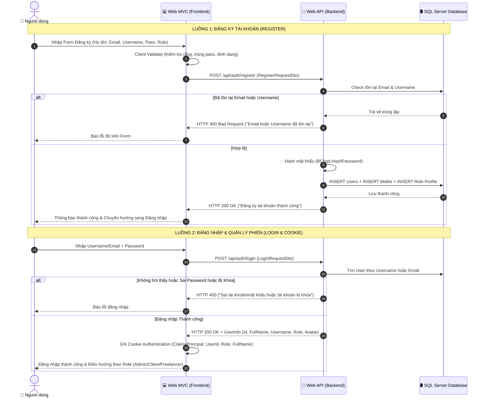

# 📋 KẾ HOẠCH CHI TIẾT TRIỂN KHAI HỆ THỐNG XÁC THỰC VÀ PHÂN QUYỀN (AUTHENTICATION & AUTHORIZATION)
> **Dành cho:** Module Đăng ký, Đăng nhập, Đăng xuất, Đổi mật khẩu & Phân quyền Role (Freelancer, Nhà tuyển dụng, Admin).  
> **Dự án:** `FreelancerStudent`  
> **Mục tiêu:** Hướng dẫn từng bước cụ thể, chi tiết, dễ hiểu nhất dành cho người mới bắt đầu (cầm tay chỉ việc).

---

## 📑 MỤC LỤC
1. [Đối chiếu Đặc tả Nghiệp vụ, Giao diện & Database](#1-đối-chiếu-đặc-tả-nghiệp-vụ-giao-diện--database)
2. [Sơ đồ Kiến trúc & Luồng Xác thực Toàn diện](#2-sơ-đồ-kiến-trúc--luồng-xác-thực-toàn-diện)
3. [Giai đoạn 1: Chuẩn bị CSDL & Models (Entities)](#3-giai-đoạn-1-chuẩn-bị-csdl--models-entities)
4. [Giai đoạn 2: Xây dựng Backend API (FreelancerStudent.API)](#4-giai-đoạn-2-xây-dựng-backend-api-freelancerstudentapi)
   - [4.1. Helper mã hóa mật khẩu (BCrypt PasswordHasher)](#41-helper-mã-hóa-mật-khẩu-bcrypt-passwordhasher)
   - [4.2. DTOs cho Xác thực (Auth DTOs)](#42-dtos-cho-xác-thực-auth-dtos)
   - [4.3. UserRepository & IUserRepository](#43-userrepository--iuserrepository)
   - [4.4. AuthService & IAuthService (Xử lý Đăng ký, Đăng nhập, Đổi MK)](#44-authservice--iauthservice-xử-lý-đăng-ký-đăng-nhập-đổi-mk)
   - [4.5. AuthController (Endpoints API)](#45-authcontroller-endpoints-api)
5. [Giai đoạn 3: Xây dựng Giao diện & Client Web (FreelancerStudent.Web)](#5-giai-đoạn-3-xây-dựng-giao-diện--client-web-freelancerstudentweb)
   - [5.1. Cấu hình Cookie Authentication & Claims trong Program.cs](#51-cấu-hình-cookie-authentication--claims-trong-programcs)
   - [5.2. ViewModels cho Form Giao diện](#52-viewmodels-cho-form-giao-diện)
   - [5.3. Web AuthService (HttpClient gọi API)](#53-web-authservice-httpclient-gọi-api)
   - [5.4. AccountController (Web MVC)](#54-accountcontroller-web-mvc)
   - [5.5. Hoàn thiện Razor Views (Đăng ký, Đăng nhập, Đổi MK)](#55-hoàn-thiện-razor-views-đăng-ký-đăng-nhập-đổi-mk)
   - [5.6. Phân quyền hiển thị Menu Navigation trên _Layout.cshtml](#56-phân-quyền-hiển-thị-menu-navigation-trên-_layoutcshtml)
6. [Giai đoạn 4: Phân quyền Truy cập (Role-Based Authorization)](#6-giai-đoạn-4-phân-quyền-truy-cập-role-based-authorization)
7. [Giai đoạn 5: Ma trận Kiểm thử Chi tiết (Test Cases)](#7-giai-đoạn-5-ma-trận-kiểm-thử-chi-tiết-test-cases)
8. [Checklist Thực hiện Từng Bước (Tiến độ)](#8-checklist-thực-hiện-từng-bước-tiến-độ)

---

## 1. Đối chiếu Đặc tả Nghiệp vụ, Giao diện & Database

### 1.1. Bảng phân tích Thực thể liên quan trong CSDL (`KETNOI_FREELANCERSV`)
Theo file CSDL chuẩn [KLCN040_FREELANCERSTUDENT.sql](file:///d:/KLTN/Improve/MOCK/KLCN040_FREELANCERSTUDENT.sql):

| Tên Bảng | Vai trò & Ý nghĩa trong hệ thống | Các trường quan trọng cần lưu ý |
| :--- | :--- | :--- |
| **`Roles`** | Lưu danh sách 3 quyền hệ thống | `maRole`: `1` (FreelancerStudent), `2` (NhaTuyenDung), `3` (Admin). |
| **`Users`** | Bảng tài khoản gốc | `maUser` (PK), `hotenUser`, `tenTaiKhoanUser`, `pashwordHash`, `emailUser`, `sdtUser`, `status` (`'ACTIVE'`, `'LOCKED'`), `maRole` (FK). |
| **`FreelancerStudents`** | Thông tin chi tiết sinh viên | `maFreelancerStudents` (PK), `maUser` (FK), `tenTruong`, `maChuyenNganh`, `namThu`, `GPA`. *(Tạo tự động khi đăng ký Role 1)* |
| **`NhaTuyenDung`** | Thông tin chi tiết nhà tuyển dụng | `maNhaTuyenDung` (PK), `maUser` (FK), `tencongty`, `linhvuc`, `diachi`. *(Tạo tự động khi đăng ký Role 2)* |
| **`Wallet`** | Ví tiền người dùng | `maWallet` (PK), `maUser` (FK), `soDuKhaDung` (mặc định = 0). *(Tạo tự động khi đăng ký tài khoản)* |

### 1.2. Quy tắc Nghiệp vụ (Business Rules) cần đảm bảo:
1. **Kiểm tra trùng lặp:** Email (`emailUser`) và Tên tài khoản (`tenTaiKhoanUser`) không được phép trùng trong CSDL.
2. **Định dạng dữ liệu:**
   - Email phải đúng định dạng (`name@domain.com`).
   - Mật khẩu tối thiểu 6 ký tự, có ít nhất 1 chữ hoa, 1 chữ số.
   - Số điện thoại từ 10 đến 11 số hợp lệ.
3. **Mã hóa bảo mật:** Không bao giờ lưu mật khẩu dạng Text thuần (Plaintext), bắt buộc mã hóa qua **BCrypt Hash**.
4. **Khởi tạo dữ liệu đi kèm:** Khi Đăng ký thành công tài khoản `Users`:
   - Tự động tạo 1 bản ghi `Wallet` với số dư = 0.
   - Nếu Role = `1` (`FreelancerStudent`): Tự động tạo bản ghi `FreelancerStudents` ban đầu.
   - Nếu Role = `2` (`NhaTuyenDung`): Tự động tạo bản ghi `NhaTuyenDung` ban đầu.
5. **Trạng thái tài khoản:** Chỉ tài khoản có `status == 'ACTIVE'` mới được phép đăng nhập. Nếu bị khóa (`'LOCKED'`), báo lỗi *"Tài khoản của bạn đã bị tạm khóa, vui lòng liên hệ Admin"*.

---

## 2. Sơ đồ Kiến trúc & Luồng Xác thực Toàn diện



---

## 3. Giai đoạn 1: Chuẩn bị CSDL & Models (Entities)

### Bước 1.1: Tạo các Entity Model trong `FreelancerStudent.API/Models`
Tạo các class C# chuẩn hóa khớp 100% theo các bảng trong CSDL (`KETNOI_FREELANCERSV`):

1. `Role.cs`:
```csharp
namespace FreelancerStudent.API.Models
{
    public class Role
    {
        public int MaRole { get; set; }
        public string TenRole { get; set; } = string.Empty;
        public virtual ICollection<User> Users { get; set; } = new List<User>();
    }
}
```

2. `User.cs`:
```csharp
using System.ComponentModel.DataAnnotations;
using System.ComponentModel.DataAnnotations.Schema;

namespace FreelancerStudent.API.Models
{
    [Table("Users")]
    public class User
    {
        [Key]
        [DatabaseGenerated(DatabaseGeneratedOption.Identity)]
        public int MaUser { get; set; }

        [Required]
        [MaxLength(100)]
        public string HotenUser { get; set; } = string.Empty;

        [Required]
        [MaxLength(30)]
        public string TenTaiKhoanUser { get; set; } = string.Empty;

        [Required]
        [MaxLength(255)]
        public string PashwordHash { get; set; } = string.Empty;

        [Required]
        [MaxLength(100)]
        [EmailAddress]
        public string EmailUser { get; set; } = string.Empty;

        [MaxLength(15)]
        public string? SdtUser { get; set; }

        public DateTime? Ngaysinh { get; set; }

        [MaxLength(20)]
        public string Status { get; set; } = "ACTIVE";

        public DateTime NgayTao { get; set; } = DateTime.UtcNow;

        public int MaRole { get; set; }

        // Navigation Properties
        [ForeignKey("MaRole")]
        public virtual Role? Role { get; set; }
        public virtual Wallet? Wallet { get; set; }
        public virtual FreelancerStudent? FreelancerStudent { get; set; }
        public virtual NhaTuyenDung? NhaTuyenDung { get; set; }
    }
}
```

3. `Wallet.cs`:
```csharp
using System.ComponentModel.DataAnnotations;
using System.ComponentModel.DataAnnotations.Schema;

namespace FreelancerStudent.API.Models
{
    [Table("Wallet")]
    public class Wallet
    {
        [Key]
        [DatabaseGenerated(DatabaseGeneratedOption.Identity)]
        public int MaWallet { get; set; }

        public int MaUser { get; set; }

        [Column(TypeName = "decimal(18,2)")]
        public decimal SoDuKhaDung { get; set; } = 0;

        [Column(TypeName = "decimal(18,2)")]
        public decimal SoDuDongBang { get; set; } = 0;

        [ForeignKey("MaUser")]
        public virtual User? User { get; set; }
    }
}
```

4. `FreelancerStudent.cs`:
```csharp
using System.ComponentModel.DataAnnotations;
using System.ComponentModel.DataAnnotations.Schema;

namespace FreelancerStudent.API.Models
{
    [Table("FreelancerStudents")]
    public class FreelancerStudent
    {
        [Key]
        [DatabaseGenerated(DatabaseGeneratedOption.Identity)]
        public int MaFreelancerStudents { get; set; }

        public int MaUser { get; set; }
        public string MaChuyenNganh { get; set; } = "CNTT";
        public string MaTruong { get; set; } = "HUTECH";
        public string TenTruong { get; set; } = "Đại học Công nghệ TP.HCM";
        public string DiaDiemTruong { get; set; } = "TP.HCM";
        public string DiaDiemFreelancerStudent { get; set; } = "TP.HCM";
        public int NamThu { get; set; } = 1;
        public double GPA { get; set; } = 0;
        public string NienKhoa { get; set; } = $"{DateTime.Now.Year}-{DateTime.Now.Year + 4}";
        public string? Avatar { get; set; }
        public string? Gioithieu { get; set; }
        public bool TrangthaiNhanViec { get; set; } = true;

        [ForeignKey("MaUser")]
        public virtual User? User { get; set; }
    }
}
```

5. `NhaTuyenDung.cs`:
```csharp
using System.ComponentModel.DataAnnotations;
using System.ComponentModel.DataAnnotations.Schema;

namespace FreelancerStudent.API.Models
{
    [Table("NhaTuyenDung")]
    public class NhaTuyenDung
    {
        [Key]
        [DatabaseGenerated(DatabaseGeneratedOption.Identity)]
        public int MaNhaTuyenDung { get; set; }

        public int MaUser { get; set; }
        public string? Avatar { get; set; }
        public string? Gioithieu { get; set; }
        public string? Tencongty { get; set; }
        public string? Linhvuc { get; set; }
        public string? Diachi { get; set; }
        public DateTime NgayDangKy { get; set; } = DateTime.UtcNow;
        public string Trangthai { get; set; } = "Active";

        [ForeignKey("MaUser")]
        public virtual User? User { get; set; }
    }
}
```

### Bước 1.2: Cấu hình DbContext trong `FreelancerStudent.API/Data/ApplicationDbContext.cs`
- Khai báo các `DbSet<User>`, `DbSet<Role>`, `DbSet<Wallet>`, `DbSet<FreelancerStudent>`, `DbSet<NhaTuyenDung>`.
- Ánh xạ tên bảng chuẩn theo SQL script.

---

## 4. Giai đoạn 2: Xây dựng Backend API (`FreelancerStudent.API`)

### 4.1. Helper mã hóa mật khẩu (BCrypt PasswordHasher)
Tạo file `FreelancerStudent.API/Helper/PasswordHasher.cs`:
- Sử dụng thư viện `BCrypt.Net-Next` (cài đặt: `dotnet add package BCrypt.Net-Next`).
```csharp
namespace FreelancerStudent.API.Helper
{
    public static class PasswordHasher
    {
        public static string HashPassword(string password)
        {
            return BCrypt.Net.BCrypt.HashPassword(password);
        }

        public static bool VerifyPassword(string password, string hashedPassword)
        {
            try
            {
                return BCrypt.Net.BCrypt.Verify(password, hashedPassword);
            }
            catch
            {
                return false;
            }
        }
    }
}
```

---

### 4.2. DTOs cho Xác thực (`FreelancerStudent.API/DTOs/Auth/`)
1. `RegisterRequestDto.cs`:
```csharp
public class RegisterRequestDto
{
    [Required(ErrorMessage = "Họ và tên không được để trống")]
    public string FullName { get; set; } = string.Empty;

    [Required(ErrorMessage = "Tên tài khoản không được để trống")]
    public string Username { get; set; } = string.Empty;

    [Required(ErrorMessage = "Email không được để trống")]
    [EmailAddress(ErrorMessage = "Email không đúng định dạng")]
    public string Email { get; set; } = string.Empty;

    [Phone(ErrorMessage = "Số điện thoại không hợp lệ")]
    public string? PhoneNumber { get; set; }

    [Required(ErrorMessage = "Mật khẩu không được để trống")]
    [MinLength(6, ErrorMessage = "Mật khẩu tối thiểu 6 ký tự")]
    public string Password { get; set; } = string.Empty;

    [Required(ErrorMessage = "Vui lòng chọn loại tài khoản")]
    [Range(1, 2, ErrorMessage = "Loại tài khoản không hợp lệ (1: Freelancer, 2: Nhà tuyển dụng)")]
    public int RoleId { get; set; } // 1: FreelancerStudent, 2: NhaTuyenDung
}
```

2. `LoginRequestDto.cs`:
```csharp
public class LoginRequestDto
{
    [Required(ErrorMessage = "Vui lòng nhập Tên tài khoản hoặc Email")]
    public string UsernameOrEmail { get; set; } = string.Empty;

    [Required(ErrorMessage = "Vui lòng nhập mật khẩu")]
    public string Password { get; set; } = string.Empty;
}
```

3. `ChangePasswordDto.cs`:
```csharp
public class ChangePasswordDto
{
    public int UserId { get; set; }

    [Required(ErrorMessage = "Vui lòng nhập mật khẩu cũ")]
    public string OldPassword { get; set; } = string.Empty;

    [Required(ErrorMessage = "Vui lòng nhập mật khẩu mới")]
    [MinLength(6, ErrorMessage = "Mật khẩu mới tối thiểu 6 ký tự")]
    public string NewPassword { get; set; } = string.Empty;
}
```

4. `AuthResponseDto.cs`:
```csharp
public class AuthResponseDto
{
    public int UserId { get; set; }
    public string FullName { get; set; } = string.Empty;
    public string Username { get; set; } = string.Empty;
    public string Email { get; set; } = string.Empty;
    public int RoleId { get; set; }
    public string RoleName { get; set; } = string.Empty;
    public string? Avatar { get; set; }
    public string Status { get; set; } = string.Empty;
}
```

---

### 4.3. UserRepository & IUserRepository (`FreelancerStudent.API/Repositories/`)
Tạo Interface `IUserRepository.cs` và Class `UserRepository.cs` chứa các hàm:
- `Task<User?> GetByIdAsync(int id);`
- `Task<User?> GetByUsernameAsync(string username);`
- `Task<User?> GetByEmailAsync(string email);`
- `Task<User?> GetByUsernameOrEmailAsync(string identifier);`
- `Task<bool> ExistsByEmailAsync(string email);`
- `Task<bool> ExistsByUsernameAsync(string username);`
- `Task<User> CreateUserWithProfileAsync(User user, int roleId);`
- `Task UpdateUserAsync(User user);`

---

### 4.4. AuthService & IAuthService (`FreelancerStudent.API/Services/`)
Triển khai logic nghiệp vụ hoàn chỉnh:
```csharp
public class AuthService : IAuthService
{
    private readonly IUserRepository _userRepo;

    public AuthService(IUserRepository userRepo)
    {
        _userRepo = userRepo;
    }

    public async Task<ApiResponse<AuthResponseDto>> RegisterAsync(RegisterRequestDto dto)
    {
        // 1. Kiểm tra trùng Email
        if (await _userRepo.ExistsByEmailAsync(dto.Email))
            return ApiResponse<AuthResponseDto>.Fail("Email này đã được sử dụng. Vui lòng chọn email khác!");

        // 2. Kiểm tra trùng Username
        if (await _userRepo.ExistsByUsernameAsync(dto.Username))
            return ApiResponse<AuthResponseDto>.Fail("Tên tài khoản này đã tồn tại. Vui lòng chọn tên khác!");

        // 3. Hash mật khẩu
        string hashedPassword = PasswordHasher.HashPassword(dto.Password);

        // 4. Khởi tạo Entity User
        var user = new User
        {
            HotenUser = dto.FullName.Trim(),
            TenTaiKhoanUser = dto.Username.Trim().ToLower(),
            EmailUser = dto.Email.Trim().ToLower(),
            SdtUser = dto.PhoneNumber?.Trim(),
            PashwordHash = hashedPassword,
            MaRole = dto.RoleId,
            Status = "ACTIVE",
            NgayTao = DateTime.UtcNow
        };

        // 5. Lưu vào CSDL kèm Profile & Wallet
        var createdUser = await _userRepo.CreateUserWithProfileAsync(user, dto.RoleId);

        // 6. Trả về kết quả
        return ApiResponse<AuthResponseDto>.Ok(new AuthResponseDto
        {
            UserId = createdUser.MaUser,
            FullName = createdUser.HotenUser,
            Username = createdUser.TenTaiKhoanUser,
            Email = createdUser.EmailUser,
            RoleId = createdUser.MaRole,
            RoleName = createdUser.MaRole == 1 ? "FreelancerStudent" : "NhaTuyenDung",
            Status = createdUser.Status
        }, "Đăng ký tài khoản thành công!");
    }

    public async Task<ApiResponse<AuthResponseDto>> LoginAsync(LoginRequestDto dto)
    {
        // 1. Tìm User theo Username hoặc Email
        var user = await _userRepo.GetByUsernameOrEmailAsync(dto.UsernameOrEmail.Trim());
        if (user == null)
            return ApiResponse<AuthResponseDto>.Fail("Tên đăng nhập hoặc mật khẩu không chính xác!");

        // 2. Kiểm tra trạng thái tài khoản
        if (user.Status != "ACTIVE")
            return ApiResponse<AuthResponseDto>.Fail("Tài khoản của bạn đã bị khóa hoặc chưa kích hoạt!");

        // 3. Xác thực mật khẩu
        bool isPasswordValid = PasswordHasher.VerifyPassword(dto.Password, user.PashwordHash);
        if (!isPasswordValid)
            return ApiResponse<AuthResponseDto>.Fail("Tên đăng nhập hoặc mật khẩu không chính xác!");

        // 4. Trả về thông tin User
        return ApiResponse<AuthResponseDto>.Ok(new AuthResponseDto
        {
            UserId = user.MaUser,
            FullName = user.HotenUser,
            Username = user.TenTaiKhoanUser,
            Email = user.EmailUser,
            RoleId = user.MaRole,
            RoleName = user.Role?.TenRole ?? (user.MaRole == 1 ? "FreelancerStudent" : (user.MaRole == 2 ? "NhaTuyenDung" : "Admin")),
            Status = user.Status
        }, "Đăng nhập thành công!");
    }

    public async Task<ApiResponse<bool>> ChangePasswordAsync(ChangePasswordDto dto)
    {
        var user = await _userRepo.GetByIdAsync(dto.UserId);
        if (user == null) return ApiResponse<bool>.Fail("Không tìm thấy thông tin tài khoản!");

        if (!PasswordHasher.VerifyPassword(dto.OldPassword, user.PashwordHash))
            return ApiResponse<bool>.Fail("Mật khẩu hiện tại không đúng!");

        user.PashwordHash = PasswordHasher.HashPassword(dto.NewPassword);
        await _userRepo.UpdateUserAsync(user);

        return ApiResponse<bool>.Ok(true, "Đổi mật khẩu thành công!");
    }
}
```

---

### 4.5. AuthController (`FreelancerStudent.API/Controllers/AuthController.cs`)
```csharp
[ApiController]
[Route("api/[controller]")]
public class AuthController : ControllerBase
{
    private readonly IAuthService _authService;

    public AuthController(IAuthService authService)
    {
        _authService = authService;
    }

    [HttpPost("register")]
    public async Task<IActionResult> Register([FromBody] RegisterRequestDto dto)
    {
        if (!ModelState.IsValid) return BadRequest(ModelState);
        var result = await _authService.RegisterAsync(dto);
        if (!result.Success) return BadRequest(result);
        return Ok(result);
    }

    [HttpPost("login")]
    public async Task<IActionResult> Login([FromBody] LoginRequestDto dto)
    {
        if (!ModelState.IsValid) return BadRequest(ModelState);
        var result = await _authService.LoginAsync(dto);
        if (!result.Success) return BadRequest(result);
        return Ok(result);
    }

    [HttpPost("change-password")]
    public async Task<IActionResult> ChangePassword([FromBody] ChangePasswordDto dto)
    {
        if (!ModelState.IsValid) return BadRequest(ModelState);
        var result = await _authService.ChangePasswordAsync(dto);
        if (!result.Success) return BadRequest(result);
        return Ok(result);
    }
}
```

---

## 5. Giai đoạn 3: Xây dựng Giao diện & Client Web (`FreelancerStudent.Web`)

### 5.1. Cấu hình Cookie Authentication trong `Program.cs` của Web MVC
Cấu hình để duy trì phiên đăng nhập của người dùng qua Cookie:
```csharp
// Trong FreelancerStudent.Web/Program.cs
builder.Services.AddAuthentication(CookieAuthenticationDefaults.AuthenticationScheme)
    .AddCookie(options =>
    {
        options.Cookie.Name = "FreelancerStudent.AuthCookie";
        options.LoginPath = "/Account/Login";
        options.AccessDeniedPath = "/Account/AccessDenied";
        options.ExpireTimeSpan = TimeSpan.FromDays(7);
        options.SlidingExpiration = true;
    });

builder.Services.AddAuthorization();
builder.Services.AddHttpContextAccessor();
```

---

### 5.2. ViewModels cho Web Form (`FreelancerStudent.Web/ViewModels/Account/`)
Tạo `RegisterViewModel.cs`:
```csharp
public class RegisterViewModel
{
    [Required(ErrorMessage = "Vui lòng chọn loại tài khoản")]
    public int RoleId { get; set; } = 1; // Mặc định 1: Freelancer

    [Required(ErrorMessage = "Vui lòng nhập họ và tên")]
    [Display(Name = "Họ và tên")]
    public string FullName { get; set; } = string.Empty;

    [Required(ErrorMessage = "Vui lòng nhập tên tài khoản")]
    [StringLength(30, MinimumLength = 4, ErrorMessage = "Tên tài khoản từ 4 đến 30 ký tự")]
    [Display(Name = "Tên tài khoản")]
    public string Username { get; set; } = string.Empty;

    [Required(ErrorMessage = "Vui lòng nhập địa chỉ email")]
    [EmailAddress(ErrorMessage = "Email không hợp lệ")]
    [Display(Name = "Email")]
    public string Email { get; set; } = string.Empty;

    [Phone(ErrorMessage = "Số điện thoại không hợp lệ")]
    [Display(Name = "Số điện thoại")]
    public string? PhoneNumber { get; set; }

    [Required(ErrorMessage = "Vui lòng nhập mật khẩu")]
    [MinLength(6, ErrorMessage = "Mật khẩu phải có ít nhất 6 ký tự")]
    [DataType(DataType.Password)]
    [Display(Name = "Mật khẩu")]
    public string Password { get; set; } = string.Empty;

    [Required(ErrorMessage = "Vui lòng xác nhận mật khẩu")]
    [DataType(DataType.Password)]
    [Compare("Password", ErrorMessage = "Mật khẩu xác nhận không khớp")]
    [Display(Name = "Xác nhận mật khẩu")]
    public string ConfirmPassword { get; set; } = string.Empty;

    [Range(typeof(bool), "true", "true", ErrorMessage = "Bạn phải đồng ý với Điều khoản dịch vụ")]
    public bool AgreeTerms { get; set; }
}
```

---

### 5.3. Web AuthService (`FreelancerStudent.Web/Services/AuthWebService.cs`)
Chịu trách nhiệm gửi Request sang `FreelancerStudent.API`:
- `Task<ApiResponse<AuthResponseDto>> RegisterAsync(RegisterViewModel model);`
- `Task<ApiResponse<AuthResponseDto>> LoginAsync(LoginViewModel model);`
- `Task<ApiResponse<bool>> ChangePasswordAsync(ChangePasswordViewModel model, int userId);`

---

### 5.4. AccountController trên Web MVC (`FreelancerStudent.Web/Controllers/AccountController.cs`)
Xử lý Cookie đăng nhập và Đăng xuất:
```csharp
public class AccountController : Controller
{
    private readonly IAuthWebService _authWebService;

    public AccountController(IAuthWebService authWebService)
    {
        _authWebService = authWebService;
    }

    // GET: /Account/Register
    [HttpGet]
    public IActionResult Register()
    {
        if (User.Identity?.IsAuthenticated == true) return RedirectToAction("Index", "Home");
        return View(new RegisterViewModel());
    }

    // POST: /Account/Register
    [HttpPost]
    [ValidateAntiForgeryToken]
    public async Task<IActionResult> Register(RegisterViewModel model)
    {
        if (!ModelState.IsValid) return View(model);

        var result = await _authWebService.RegisterAsync(model);
        if (result.Success)
        {
            TempData["SuccessMessage"] = "Đăng ký tài khoản thành công! Vui lòng đăng nhập.";
            return RedirectToAction(nameof(Login));
        }

        ModelState.AddModelError("", result.Message);
        return View(model);
    }

    // GET: /Account/Login
    [HttpGet]
    public IActionResult Login(string? returnUrl = null)
    {
        if (User.Identity?.IsAuthenticated == true) return RedirectToAction("Index", "Home");
        ViewData["ReturnUrl"] = returnUrl;
        return View(new LoginViewModel());
    }

    // POST: /Account/Login
    [HttpPost]
    [ValidateAntiForgeryToken]
    public async Task<IActionResult> Login(LoginViewModel model, string? returnUrl = null)
    {
        if (!ModelState.IsValid) return View(model);

        var result = await _authWebService.LoginAsync(model);
        if (!result.Success || result.Data == null)
        {
            ModelState.AddModelError("", result.Message);
            return View(model);
        }

        var userInfo = result.Data;

        // TẠO CLAIMS VÀ COOKIE ĐĂNG NHẬP
        var claims = new List<Claim>
        {
            new Claim(ClaimTypes.NameIdentifier, userInfo.UserId.ToString()),
            new Claim(ClaimTypes.Name, userInfo.Username),
            new Claim("FullName", userInfo.FullName),
            new Claim(ClaimTypes.Email, userInfo.Email),
            new Claim(ClaimTypes.Role, userInfo.RoleName),
            new Claim("Avatar", userInfo.Avatar ?? "/images/default-avatar.png")
        };

        var claimsIdentity = new ClaimsIdentity(claims, CookieAuthenticationDefaults.AuthenticationScheme);
        var authProperties = new AuthenticationProperties
        {
            IsPersistent = model.RememberMe,
            ExpiresUtc = DateTimeOffset.UtcNow.AddDays(7)
        };

        await HttpContext.SignInAsync(CookieAuthenticationDefaults.AuthenticationScheme, new ClaimsPrincipal(claimsIdentity), authProperties);

        TempData["SuccessMessage"] = $"Chào mừng bạn trở lại, {userInfo.FullName}!";

        if (!string.IsNullOrEmpty(returnUrl) && Url.IsLocalUrl(returnUrl))
            return Redirect(returnUrl);

        // Điều hướng theo Role
        if (userInfo.RoleName == "Admin") return RedirectToAction("Index", "Admin");
        if (userInfo.RoleName == "NhaTuyenDung") return RedirectToAction("Index", "Employer");
        return RedirectToAction("Index", "Home");
    }

    // POST: /Account/Logout
    [HttpPost]
    [ValidateAntiForgeryToken]
    public async Task<IActionResult> Logout()
    {
        await HttpContext.SignOutAsync(CookieAuthenticationDefaults.AuthenticationScheme);
        TempData["SuccessMessage"] = "Bạn đã đăng xuất thành công!";
        return RedirectToAction("Index", "Home");
    }

    // GET: /Account/AccessDenied
    [HttpGet]
    public IActionResult AccessDenied()
    {
        return View();
    }
}
```

---

### 5.5. Hoàn thiện Razor Views
- Sử dụng giao diện từ [MOCK/Views/Account/Register.cshtml](file:///d:/KLTN/Improve/MOCK/Views/Account/Register.cshtml) và [MOCK/Views/Account/Login.cshtml](file:///d:/KLTN/Improve/MOCK/Views/Account/Login.cshtml).
- Đảm bảo các `asp-for`, `asp-validation-for` khớp với `RegisterViewModel`.
- Thẻ chọn Role: Radio Card chọn 1 (Freelancer) hoặc 2 (Nhà tuyển dụng).

---

### 5.6. Phân quyền hiển thị Menu Navigation trên `_Layout.cshtml`
Sử dụng `User.Identity.IsAuthenticated` và `User.IsInRole()` thay cho dữ liệu giả lập:
```html
@if (User.Identity?.IsAuthenticated == true)
{
    var fullName = User.FindFirst("FullName")?.Value ?? User.Identity.Name;
    var role = User.FindFirst(System.Security.Claims.ClaimTypes.Role)?.Value;
    var avatar = User.FindFirst("Avatar")?.Value ?? "/images/default-avatar.png";

    <!-- Menu dành cho Nhà Tuyển Dụng -->
    @if (User.IsInRole("NhaTuyenDung"))
    {
        <li class="nav-item"><a class="nav-link" asp-controller="Job" asp-action="Create">Đăng tin tuyển dụng</a></li>
        <li class="nav-link"><a class="nav-link" asp-controller="Employer" asp-action="ManageJobs">Quản lý tin đăng</a></li>
    }

    <!-- Menu dành cho Freelancer Sinh Viên -->
    @if (User.IsInRole("FreelancerStudent"))
    {
        <li class="nav-item"><a class="nav-link" asp-controller="Job" asp-action="Index">Tìm việc làm</a></li>
        <li class="nav-item"><a class="nav-link" asp-controller="Freelancer" asp-action="MyApplications">Việc đã ứng tuyển</a></li>
    }

    <!-- User Dropdown & Nút Đăng Xuất -->
    <div class="dropdown">
        <button class="btn btn-outline-secondary dropdown-toggle" data-bs-toggle="dropdown">
             @fullName (@role)
        </button>
        <ul class="dropdown-menu dropdown-menu-end">
            <li><a class="dropdown-item" asp-controller="Account" asp-action="Profile">Trang cá nhân</a></li>
            <li><a class="dropdown-item" asp-controller="Account" asp-action="ChangePassword">Đổi mật khẩu</a></li>
            <li><hr class="dropdown-divider"></li>
            <li>
                <form asp-controller="Account" asp-action="Logout" method="post">
                    <button type="submit" class="dropdown-item text-danger">🚪 Đăng xuất</button>
                </form>
            </li>
        </ul>
    </div>
}
else
{
    <!-- Khi chưa đăng nhập -->
    <a asp-controller="Account" asp-action="Login" class="btn btn-outline-primary me-2">Đăng nhập</a>
    <a asp-controller="Account" asp-action="Register" class="btn btn-primary">Đăng ký</a>
}
```

---

## 6. Giai đoạn 4: Phân quyền Truy cập (Role-Based Authorization)

Sử dụng thuộc tính `[Authorize]` trên các Controller/Action tương ứng:

```csharp
// 1. Chỉ Admin mới được vào
[Authorize(Roles = "Admin")]
public class AdminController : Controller { ... }

// 2. Chỉ Nhà tuyển dụng mới được vào
[Authorize(Roles = "NhaTuyenDung")]
public class EmployerController : Controller { ... }

// 3. Chỉ Freelancer mới được vào
[Authorize(Roles = "FreelancerStudent")]
public class FreelancerController : Controller { ... }

// 4. Bất kỳ ai đã đăng nhập (Cả 3 vai trò)
[Authorize]
public class WalletController : Controller { ... }
```

---

## 7. Giai đoạn 5: Ma trận Kiểm thử Chi tiết (Test Cases)

| Mã Test | Tính năng | Dữ liệu đầu vào (Input) | Kết quả mong đợi (Expected Output) | Trạng thái |
| :---: | :--- | :--- | :--- | :---: |
| **TC-01** | Đăng ký | Để trống tất cả các trường | Báo lỗi đỏ dưới từng ô nhập liệu | ⏳ Chưa test |
| **TC-02** | Đăng ký | Nhập Email đã có trong CSDL | Báo lỗi *"Email này đã được sử dụng"* | ⏳ Chưa test |
| **TC-03** | Đăng ký | Nhập Username đã có trong CSDL | Báo lỗi *"Tên tài khoản này đã tồn tại"* | ⏳ Chưa test |
| **TC-04** | Đăng ký | Nhập mật khẩu xác nhận không khớp | Báo lỗi *"Mật khẩu xác nhận không khớp"* | ⏳ Chưa test |
| **TC-05** | Đăng ký | Nhập đúng tất cả thông tin (Role Freelancer) | Tạo User + Profile + Wallet trong DB, điều hướng sang Login | ⏳ Chưa test |
| **TC-06** | Đăng ký | Nhập đúng tất cả thông tin (Role Nhà tuyển dụng) | Tạo User + NhaTuyenDung Profile + Wallet trong DB | ⏳ Chưa test |
| **TC-07** | Đăng nhập | Nhập sai Username hoặc sai Password | Báo lỗi *"Tên đăng nhập hoặc mật khẩu không chính xác"* | ⏳ Chưa test |
| **TC-08** | Đăng nhập | Đăng nhập bằng tài khoản `status = 'LOCKED'` | Báo lỗi *"Tài khoản của bạn đã bị khóa"* | ⏳ Chưa test |
| **TC-09** | Đăng nhập | Đăng nhập đúng thông tin | Ghi nhận Cookie, hiển thị Tên + Role trên Navbar | ⏳ Chưa test |
| **TC-10** | Đăng xuất | Bấm nút Đăng xuất | Hủy Cookie, Navbar quay về trạng thái chưa đăng nhập | ⏳ Chưa test |
| **TC-11** | Đổi MK | Nhập sai mật khẩu cũ | Báo lỗi *"Mật khẩu hiện tại không đúng"* | ⏳ Chưa test |
| **TC-12** | Đổi MK | Nhập đúng mật khẩu cũ + MK mới hợp lệ | Cập nhật mật khẩu mới mã hóa trong DB, báo thành công | ⏳ Chưa test |
| **TC-13** | Phân quyền | Freelancer cố tình gõ link `/Admin/Index` | Bị chặn và chuyển hướng sang trang `/Account/AccessDenied` | ⏳ Chưa test |

---

## 8. Checklist Thực hiện Từng Bước (Tiến độ)

- [ ] **Bước 1:** Cài package `BCrypt.Net-Next` và `Microsoft.EntityFrameworkCore.SqlServer` vào API.
- [ ] **Bước 2:** Tạo Models (`User`, `Role`, `Wallet`) và cấu hình `ApplicationDbContext`.
- [ ] **Bước 3:** Tạo `PasswordHasher.cs` trong thư mục Helper.
- [ ] **Bước 4:** Tạo các `DTOs` (Register, Login, ChangePassword, AuthResponse).
- [ ] **Bước 5:** Tạo `UserRepository` và `AuthService` trong API.
- [ ] **Bước 6:** Tạo `AuthController` và kiểm thử các API trên Swagger.
- [ ] **Bước 7:** Cấu hình `CookieAuthentication` trong Web `Program.cs`.
- [ ] **Bước 8:** Tạo `AuthWebService` và `AccountController` trong Web.
- [ ] **Bước 9:** Tích hợp giao diện `Register.cshtml`, `Login.cshtml` từ thư mục MOCK.
- [ ] **Bước 10:** Cập nhật `_Layout.cshtml` để hiển thị menu theo quyền (Roles).
- [ ] **Bước 11:** Thực hiện chạy toàn bộ 13 Test Case trong bảng kiểm thử.
