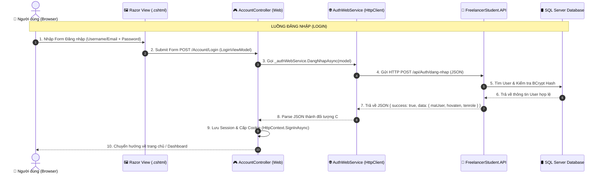

# 📑 KẾ HOẠCH CHI TIẾT KẾT NỐI ĐĂNG KÝ & ĐĂNG NHẬP TỪ WEB SANG API
> **Dự án:** `FreelancerStudent`  
> **Phạm vi:** Kết nối tầng giao diện (`FreelancerStudent.Web`) sang Backend API (`FreelancerStudent.API`)  
> **Mục tiêu:** Hướng dẫn chi tiết từng bước, cầm tay chỉ việc, dễ hiểu nhất cho người mới bắt đầu.

---

## 📑 MỤC LỤC
1. [Sơ đồ Luồng Hoạt Động Từ Web Sang API](#1-sơ-đồ-luồng-hoạt-động-từ-web-sang-api)
2. [Chi Tiết 6 Bước Triển Khai Bên Web](#2-chi-tiết-6-bước-triển-khai-bên-web)
   - [Bước 1: Cấu hình `Program.cs` (HttpClient + Session + Cookie)](#bước-1-cấu-hình-programcs-httpclient--session--cookie)
   - [Bước 2: Tạo DTOs & ViewModels cho Form](#bước-2-tạo-dtos--viewmodels-cho-form)
   - [Bước 3: Viết Web Service (`AuthWebService.cs` gọi API)](#bước-3-viết-web-service-authwebservices-gọi-api)
   - [Bước 4: Viết `AccountController.cs` (Quản lý Form & Phiên)](#bước-4-viết-accountcontrollercs-quản-lý-form--phiên)
   - [Bước 5: Ghép Giao diện Razor Views (`Register.cshtml` & `Login.cshtml`)](#bước-5-ghép-giao-diện-razor-views-registercshtml--logincshtml)
   - [Bước 6: Cập nhật Thanh Điều Hướng Header (`_Layout.cshtml`)](#bước-6-cập-nhật-thanh-điều-hướng-header-_layoutcshtml)
3. [Xử Lý Session & Phân Quyền Vai Trò (Roles)](#3-xử-lý-session--phân-quyền-vai-trò-roles)
4. [Ma Trận Kiểm Thử Thực Tế (Test Cases)](#4-ma-trận-kiểm-thử-thực-tế-test-cases)
5. [Checklist Tiến Độ Từng Bước](#5-checklist-tiến-độ-từng-bước)

---

## 1. Sơ đồ Luồng Hoạt Động Từ Web Sang API



---

## 2. Chi Tiết 6 Bước Triển Khai Bên Web

### Bước 1: Cấu hình `Program.cs` (HttpClient + Session + Cookie)

Mở file **`FreelancerStudent.Web/Program.cs`** và cấu hình 3 thành phần cốt lõi:

```csharp
using Microsoft.AspNetCore.Authentication.Cookies;
using FreelancerStudent.Web.Services;
using FreelancerStudent.Web.Services.Interfaces;

var builder = WebApplication.CreateBuilder(args);

builder.Services.AddControllersWithViews();

// 1. Cấu hình HttpClient gọi sang API Backend
builder.Services.AddHttpClient("ApiClient", client =>
{
    // Cổng Port của FreelancerStudent.API khi chạy (xem trên Swagger)
    client.BaseAddress = new Uri("https://localhost:5152/"); 
});

// 2. Cấu hình Session (Lưu biến tạm trong bộ nhớ)
builder.Services.AddDistributedMemoryCache();
builder.Services.AddSession(options =>
{
    options.IdleTimeout = TimeSpan.FromMinutes(30);
    options.Cookie.HttpOnly = true;
    options.Cookie.IsEssential = true;
});

// 3. Cấu hình Cookie Authentication (Bảo mật & Phân quyền)
builder.Services.AddAuthentication(CookieAuthenticationDefaults.AuthenticationScheme)
    .AddCookie(options =>
    {
        options.Cookie.Name = "FreelancerStudent.AuthCookie";
        options.LoginPath = "/Account/Login";
        options.AccessDeniedPath = "/Account/AccessDenied";
        options.ExpireTimeSpan = TimeSpan.FromDays(7);
        options.SlidingExpiration = true;
    });

// 4. Đăng ký Web Service
builder.Services.AddScoped<IAuthWebService, AuthWebService>();

var app = builder.Build();

if (!app.Environment.IsDevelopment())
{
    app.UseExceptionHandler("/Home/Error");
    app.UseHsts();
}

app.UseHttpsRedirection();
app.UseStaticFiles();
app.UseRouting();

// ⚠️ THỨ TỰ BẮT BUỘC TRONG PIPELINE:
app.UseSession();        // 1. Bật Session
app.UseAuthentication(); // 2. Bật Xác thực (Ai đang đăng nhập?)
app.UseAuthorization();  // 3. Bật Phân quyền (Được phép làm gì?)

app.MapControllerRoute(
    name: "default",
    pattern: "{controller=Home}/{action=Index}/{id?}");

app.Run();
```

---

### Bước 2: Tạo DTOs & ViewModels cho Form

#### 2.1. File `ViewModels/ApiResponse.cs` (Đóng gói phản hồi từ API)
Tạo file: **`FreelancerStudent.Web/ViewModels/ApiResponse.cs`**
```csharp
namespace FreelancerStudent.Web.ViewModels
{
    public class ApiResponse<T>
    {
        public bool Success { get; set; }
        public string Message { get; set; } = string.Empty;
        public T? Data { get; set; }
    }
}
```

#### 2.2. File `ViewModels/Account/RegisterViewModel.cs`
Tạo file: **`FreelancerStudent.Web/ViewModels/Account/RegisterViewModel.cs`**
```csharp
using System.ComponentModel.DataAnnotations;

namespace FreelancerStudent.Web.ViewModels.Account
{
    public class RegisterViewModel
    {
        [Required(ErrorMessage = "Vui lòng nhập họ và tên")]
        [Display(Name = "Họ và tên")]
        public string HoVaTen { get; set; } = string.Empty;

        [Required(ErrorMessage = "Vui lòng nhập tên tài khoản")]
        [StringLength(30, MinimumLength = 3, ErrorMessage = "Tên tài khoản từ 3 - 30 ký tự")]
        [Display(Name = "Tên tài khoản")]
        public string TenTaiKhoan { get; set; } = string.Empty;

        [Required(ErrorMessage = "Vui lòng nhập email")]
        [EmailAddress(ErrorMessage = "Email không đúng định dạng")]
        [Display(Name = "Email")]
        public string Email { get; set; } = string.Empty;

        [Phone(ErrorMessage = "Số điện thoại không hợp lệ")]
        [Display(Name = "Số điện thoại")]
        public string? SoDienThoai { get; set; }

        [Required(ErrorMessage = "Vui lòng nhập mật khẩu")]
        [MinLength(6, ErrorMessage = "Mật khẩu tối thiểu 6 ký tự")]
        [DataType(DataType.Password)]
        [Display(Name = "Mật khẩu")]
        public string Password { get; set; } = string.Empty;

        [Required(ErrorMessage = "Vui lòng xác nhận lại mật khẩu")]
        [DataType(DataType.Password)]
        [Compare("Password", ErrorMessage = "Mật khẩu xác nhận không khớp")]
        [Display(Name = "Xác nhận mật khẩu")]
        public string XacNhanMatKhau { get; set; } = string.Empty;

        [Required(ErrorMessage = "Vui lòng chọn loại tài khoản")]
        [Display(Name = "Loại tài khoản")]
        public int MaRole { get; set; } = 1; // 1: Freelancer, 2: Nhà tuyển dụng
    }
}
```

#### 2.3. File `ViewModels/Account/LoginViewModel.cs`
Tạo file: **`FreelancerStudent.Web/ViewModels/Account/LoginViewModel.cs`**
```csharp
using System.ComponentModel.DataAnnotations;

namespace FreelancerStudent.Web.ViewModels.Account
{
    public class LoginViewModel
    {
        [Required(ErrorMessage = "Vui lòng nhập Tên tài khoản hoặc Email")]
        [Display(Name = "Tài khoản hoặc Email")]
        public string TaiKhoanHoacEmail { get; set; } = string.Empty;

        [Required(ErrorMessage = "Vui lòng nhập Mật khẩu")]
        [DataType(DataType.Password)]
        [Display(Name = "Mật khẩu")]
        public string Password { get; set; } = string.Empty;

        [Display(Name = "Ghi nhớ đăng nhập")]
        public bool RememberMe { get; set; } = false;
    }
}
```

#### 2.4. File `ViewModels/Account/UserSessionViewModel.cs` (Dữ liệu trả về từ API)
Tạo file: **`FreelancerStudent.Web/ViewModels/Account/UserSessionViewModel.cs`**
```csharp
namespace FreelancerStudent.Web.ViewModels.Account
{
    public class UserSessionViewModel
    {
        public int maUser { get; set; }
        public string hovaten { get; set; } = string.Empty;
        public string tentaikhoan { get; set; } = string.Empty;
        public string email { get; set; } = string.Empty;
        public string? sodienthoai { get; set; }
        public int marole { get; set; }
        public string tenrole { get; set; } = string.Empty;
        public string status { get; set; } = string.Empty;
    }
}
```

---

### Bước 3: Viết Web Service (`AuthWebService.cs` gọi API)

#### 3.1. Interface `Services/Interfaces/IAuthWebService.cs`
Tạo file: **`FreelancerStudent.Web/Services/Interfaces/IAuthWebService.cs`**
```csharp
using FreelancerStudent.Web.ViewModels;
using FreelancerStudent.Web.ViewModels.Account;

namespace FreelancerStudent.Web.Services.Interfaces
{
    public interface IAuthWebService
    {
        // Gửi dữ liệu Đăng ký sang API
        Task<ApiResponse<UserSessionViewModel>> DangKyAsync(RegisterViewModel model);

        // Gửi dữ liệu Đăng nhập sang API
        Task<ApiResponse<UserSessionViewModel>> DangNhapAsync(LoginViewModel model);
    }
}
```

#### 3.2. Class `Services/AuthWebService.cs`
Tạo file: **`FreelancerStudent.Web/Services/AuthWebService.cs`**
```csharp
using System.Text;
using System.Text.Json;
using FreelancerStudent.Web.Services.Interfaces;
using FreelancerStudent.Web.ViewModels;
using FreelancerStudent.Web.ViewModels.Account;

namespace FreelancerStudent.Web.Services
{
    public class AuthWebService : IAuthWebService
    {
        private readonly HttpClient _httpClient;
        private readonly JsonSerializerOptions _jsonOptions;

        public AuthWebService(IHttpClientFactory httpClientFactory)
        {
            _httpClient = httpClientFactory.CreateClient("ApiClient");
            _jsonOptions = new JsonSerializerOptions { PropertyNameCaseInsensitive = true };
        }

        // 1. GỌI API ĐĂNG KÝ
        public async Task<ApiResponse<UserSessionViewModel>> DangKyAsync(RegisterViewModel model)
        {
            var apiRequest = new
            {
                hovaten = model.HoVaTen,
                tentaikhoan = model.TenTaiKhoan,
                email = model.Email,
                sodienthoai = model.SoDienThoai,
                password = model.Password,
                xacnhanmatkhau = model.XacNhanMatKhau,
                marole = model.MaRole
            };

            var jsonContent = new StringContent(JsonSerializer.Serialize(apiRequest), Encoding.UTF8, "application/json");
            var response = await _httpClient.PostAsync("api/Auth/dang-ky", jsonContent);
            var responseBody = await response.Content.ReadAsStringAsync();

            try
            {
                return JsonSerializer.Deserialize<ApiResponse<UserSessionViewModel>>(responseBody, _jsonOptions)
                       ?? new ApiResponse<UserSessionViewModel> { Success = false, Message = "Không thể phân tích phản hồi từ máy chủ!" };
            }
            catch
            {
                return new ApiResponse<UserSessionViewModel> { Success = false, Message = "Lỗi kết nối máy chủ API!" };
            }
        }

        // 2. GỌI API ĐĂNG NHẬP
        public async Task<ApiResponse<UserSessionViewModel>> DangNhapAsync(LoginViewModel model)
        {
            var apiRequest = new
            {
                taiKhoanHoacEmail = model.TaiKhoanHoacEmail,
                password = model.Password
            };

            var jsonContent = new StringContent(JsonSerializer.Serialize(apiRequest), Encoding.UTF8, "application/json");
            var response = await _httpClient.PostAsync("api/Auth/dang-nhap", jsonContent);
            var responseBody = await response.Content.ReadAsStringAsync();

            try
            {
                return JsonSerializer.Deserialize<ApiResponse<UserSessionViewModel>>(responseBody, _jsonOptions)
                       ?? new ApiResponse<UserSessionViewModel> { Success = false, Message = "Không thể phân tích phản hồi từ máy chủ!" };
            }
            catch
            {
                return new ApiResponse<UserSessionViewModel> { Success = false, Message = "Lỗi kết nối máy chủ API!" };
            }
        }
    }
}
```

---

### Bước 4: Viết `AccountController.cs` (Quản lý Form & Phiên)

Tạo file: **`FreelancerStudent.Web/Controllers/AccountController.cs`**

```csharp
using System.Security.Claims;
using Microsoft.AspNetCore.Authentication;
using Microsoft.AspNetCore.Authentication.Cookies;
using Microsoft.AspNetCore.Mvc;
using FreelancerStudent.Web.Services.Interfaces;
using FreelancerStudent.Web.ViewModels.Account;

namespace FreelancerStudent.Web.Controllers
{
    public class AccountController : Controller
    {
        private readonly IAuthWebService _authWebService;

        public AccountController(IAuthWebService authWebService)
        {
            _authWebService = authWebService;
        }

        // ==================== 1. ĐĂNG KÝ ====================
        [HttpGet]
        public IActionResult Register()
        {
            if (User.Identity?.IsAuthenticated == true)
                return RedirectToAction("Index", "Home");

            return View(new RegisterViewModel());
        }

        [HttpPost]
        [ValidateAntiForgeryToken]
        public async Task<IActionResult> Register(RegisterViewModel model)
        {
            if (!ModelState.IsValid)
                return View(model);

            var result = await _authWebService.DangKyAsync(model);

            if (result.Success)
            {
                TempData["SuccessMessage"] = "Đăng ký tài khoản thành công! Vui lòng đăng nhập.";
                return RedirectToAction(nameof(Login));
            }

            ModelState.AddModelError(string.Empty, result.Message);
            return View(model);
        }

        // ==================== 2. ĐĂNG NHẬP ====================
        [HttpGet]
        public IActionResult Login(string? returnUrl = null)
        {
            if (User.Identity?.IsAuthenticated == true)
                return RedirectToAction("Index", "Home");

            ViewData["ReturnUrl"] = returnUrl;
            return View(new LoginViewModel());
        }

        [HttpPost]
        [ValidateAntiForgeryToken]
        public async Task<IActionResult> Login(LoginViewModel model, string? returnUrl = null)
        {
            if (!ModelState.IsValid)
                return View(model);

            var result = await _authWebService.DangNhapAsync(model);

            if (!result.Success || result.Data == null)
            {
                ModelState.AddModelError(string.Empty, result.Message);
                return View(model);
            }

            var user = result.Data;

            // 👉 A. LƯU THÔNG TIN VÀO SESSION (Cho View/Layout đọc nhanh)
            HttpContext.Session.SetInt32("UserId", user.maUser);
            HttpContext.Session.SetString("UserName", user.hovaten);
            HttpContext.Session.SetString("UserRole", user.tenrole);

            // 👉 B. CẤP COOKIE CLAIMS (Dùng để phân quyền [Authorize(Roles = "...")])
            var claims = new List<Claim>
            {
                new Claim(ClaimTypes.NameIdentifier, user.maUser.ToString()),
                new Claim(ClaimTypes.Name, user.hovaten),
                new Claim(ClaimTypes.Email, user.email),
                new Claim(ClaimTypes.Role, user.tenrole)
            };

            var claimsIdentity = new ClaimsIdentity(claims, CookieAuthenticationDefaults.AuthenticationScheme);
            var authProperties = new AuthenticationProperties
            {
                IsPersistent = model.RememberMe,
                ExpiresUtc = DateTimeOffset.UtcNow.AddDays(7)
            };

            await HttpContext.SignInAsync(CookieAuthenticationDefaults.AuthenticationScheme, new ClaimsPrincipal(claimsIdentity), authProperties);

            TempData["SuccessMessage"] = $"Chào mừng bạn trở lại, {user.hovaten}!";

            if (!string.IsNullOrEmpty(returnUrl) && Url.IsLocalUrl(returnUrl))
                return Redirect(returnUrl);

            return RedirectToAction("Index", "Home");
        }

        // ==================== 3. ĐĂNG XUẤT ====================
        [HttpPost]
        [ValidateAntiForgeryToken]
        public async Task<IActionResult> Logout()
        {
            // 1. Xóa toàn bộ Session
            HttpContext.Session.Clear();

            // 2. Xóa Cookie đăng nhập
            await HttpContext.SignOutAsync(CookieAuthenticationDefaults.AuthenticationScheme);

            TempData["SuccessMessage"] = "Bạn đã đăng xuất thành công!";
            return RedirectToAction("Index", "Home");
        }

        // ==================== 4. TRANG TỪ CHỐI TRUY CẬP ====================
        [HttpGet]
        public IActionResult AccessDenied()
        {
            return View();
        }
    }
}
```

---

### Bước 5: Ghép Giao diện Razor Views (`Register.cshtml` & `Login.cshtml`)

Tạo thư mục **`FreelancerStudent.Web/Views/Account/`** và sao chép/tạo các file:

#### 5.1. File `Views/Account/Login.cshtml`
```html
@model FreelancerStudent.Web.ViewModels.Account.LoginViewModel
@{
    ViewData["Title"] = "Đăng nhập";
}

<div class="container py-5">
    <div class="row justify-content-center">
        <div class="col-md-5">
            <div class="card shadow-sm border-0 rounded-4 p-4">
                <h3 class="text-center fw-bold mb-4">Đăng Nhập Tài Khoản</h3>

                @if (TempData["SuccessMessage"] != null)
                {
                    <div class="alert alert-success">@TempData["SuccessMessage"]</div>
                }

                <form asp-action="Login" method="post">
                    <div asp-validation-summary="ModelOnly" class="text-danger mb-3"></div>

                    <div class="mb-3">
                        <label asp-for="TaiKhoanHoacEmail" class="form-label fw-semibold"></label>
                        <input asp-for="TaiKhoanHoacEmail" class="form-control" placeholder="Nhập username hoặc email..." />
                        <span asp-validation-for="TaiKhoanHoacEmail" class="text-danger"></span>
                    </div>

                    <div class="mb-3">
                        <label asp-for="Password" class="form-label fw-semibold"></label>
                        <input asp-for="Password" class="form-control" placeholder="Nhập mật khẩu..." />
                        <span asp-validation-for="Password" class="text-danger"></span>
                    </div>

                    <div class="mb-3 form-check">
                        <input asp-for="RememberMe" class="form-check-input" />
                        <label asp-for="RememberMe" class="form-check-label"></label>
                    </div>

                    <button type="submit" class="btn btn-success w-100 py-2 fw-bold">Đăng Nhập</button>
                </form>

                <div class="text-center mt-3">
                    <span>Chưa có tài khoản? <a asp-action="Register">Đăng ký ngay</a></span>
                </div>
            </div>
        </div>
    </div>
</div>

@section Scripts {
    @{await Html.RenderPartialAsync("_ValidationScriptsPartial");}
}
```

---

### Bước 6: Cập nhật Thanh Điều Hướng Header (`_Layout.cshtml`)

Mở file **`FreelancerStudent.Web/Views/Shared/_Layout.cshtml`** và bổ sung logic hiển thị:

```html
@using Microsoft.AspNetCore.Http
@{
    var userName = Context.Session.GetString("UserName") ?? User.Identity?.Name;
    var userRole = Context.Session.GetString("UserRole");
}

<nav class="navbar navbar-expand-lg navbar-light bg-white border-bottom shadow-sm">
    <div class="container">
        <a class="navbar-brand fw-bold text-success" asp-controller="Home" asp-action="Index">
            🎓 FreelancerStudent
        </a>

        <div class="collapse navbar-collapse">
            <ul class="navbar-nav me-auto">
                <li class="nav-item"><a class="nav-link" asp-controller="Home" asp-action="Index">Trang chủ</a></li>
                
                @* Menu dành riêng cho Freelancer Sinh Viên *@
                @if (userRole == "FreelancerStudent" || User.IsInRole("FreelancerStudent"))
                {
                    <li class="nav-item"><a class="nav-link" href="#">🔍 Tìm việc làm</a></li>
                    <li class="nav-item"><a class="nav-link" href="#">📄 Việc đã ứng tuyển</a></li>
                }

                @* Menu dành riêng cho Nhà Tuyển Dụng *@
                @if (userRole == "NhaTuyenDung" || User.IsInRole("NhaTuyenDung"))
                {
                    <li class="nav-item"><a class="nav-link" href="#">📝 Đăng tin tuyển dụng</a></li>
                    <li class="nav-item"><a class="nav-link" href="#">📊 Quản lý tin đăng</a></li>
                }
            </ul>

            <div class="d-flex align-items-center">
                @if (User.Identity?.IsAuthenticated == true || !string.IsNullOrEmpty(userName))
                {
                    @* Khi ĐÃ đăng nhập *@
                    <div class="dropdown">
                        <button class="btn btn-outline-success dropdown-toggle fw-semibold" data-bs-toggle="dropdown">
                            👤 @userName (@userRole)
                        </button>
                        <ul class="dropdown-menu dropdown-menu-end">
                            <li><a class="dropdown-item" href="#">Hồ sơ cá nhân</a></li>
                            <li><hr class="dropdown-divider"></li>
                            <li>
                                <form asp-controller="Account" asp-action="Logout" method="post" class="d-inline">
                                    <button type="submit" class="dropdown-item text-danger">🚪 Đăng xuất</button>
                                </form>
                            </li>
                        </ul>
                    </div>
                }
                else
                {
                    @* Khi CHƯA đăng nhập *@
                    <a asp-controller="Account" asp-action="Login" class="btn btn-outline-success me-2">Đăng nhập</a>
                    <a asp-controller="Account" asp-action="Register" class="btn btn-success">Đăng ký</a>
                }
            </div>
        </div>
    </div>
</nav>
```

---

## 3. Xử Lý Session & Phân Quyền Vai Trò (Roles)

Khi cần bảo vệ một Controller hoặc một trang nào đó để chỉ đúng quyền mới được vào:

```csharp
// 1. Chỉ Nhà tuyển dụng mới được vào trang này
[Authorize(Roles = "NhaTuyenDung")]
public class EmployerController : Controller
{
    public IActionResult Index() => View();
}

// 2. Chỉ Freelancer mới được vào
[Authorize(Roles = "FreelancerStudent")]
public class FreelancerController : Controller
{
    public IActionResult Index() => View();
}
```

---

## 4. Ma Trận Kiểm Thử Thực Tế (Test Cases)

| Mã Test | Thao tác thực hiện | Kết quả mong đợi | Trạng thái |
| :---: | :--- | :--- | :---: |
| **TC-01** | Bấm Đăng ký bỏ trống các ô | Hiển thị thông báo lỗi màu đỏ dưới từng ô nhập liệu | ⏳ Chờ test |
| **TC-02** | Đăng ký nhập mật khẩu xác nhận sai | Báo lỗi *"Mật khẩu xác nhận không khớp"* | ⏳ Chờ test |
| **TC-03** | Đăng ký nhập email trùng | Nhận thông báo từ API *"Email này đã được sử dụng"* | ⏳ Chờ test |
| **TC-04** | Đăng ký thành công | Tự động chuyển hướng sang trang Login kèm thông báo xanh | ⏳ Chờ test |
| **TC-05** | Đăng nhập sai mật khẩu | Báo lỗi *"Tên đăng nhập hoặc mật khẩu không chính xác"* | ⏳ Chờ test |
| **TC-06** | Đăng nhập thành công | Hiển thị Tên + Menu theo Role trên Header | ⏳ Chờ test |
| **TC-07** | Bấm nút Đăng xuất | Xóa Session, xóa Cookie, Header quay về nút [Đăng nhập/Đăng ký] | ⏳ Chờ test |

---

## 5. Checklist Tiến Độ Từng Bước

- [ ] **Bước 1:** Cấu hình `Program.cs` bên Web (`HttpClient`, `Session`, `CookieAuthentication`).
- [ ] **Bước 2:** Tạo các ViewModels (`RegisterViewModel`, `LoginViewModel`, `ApiResponse`).
- [ ] **Bước 3:** Viết Web Service (`AuthWebService.cs` gọi `POST api/Auth/dang-ky` và `POST api/Auth/dang-nhap`).
- [ ] **Bước 4:** Tạo `AccountController.cs` xử lý Register, Login (`SignInAsync`), Logout (`SignOutAsync`).
- [ ] **Bước 5:** Ghép giao diện `Register.cshtml`, `Login.cshtml` vào `Views/Account/`.
- [ ] **Bước 6:** Sửa thanh Header `_Layout.cshtml` hiển thị Tên & Menu theo Role.
- [ ] **Bước 7:** Chạy đồng thời cả 2 project API & Web để kiểm thử toàn diện.
