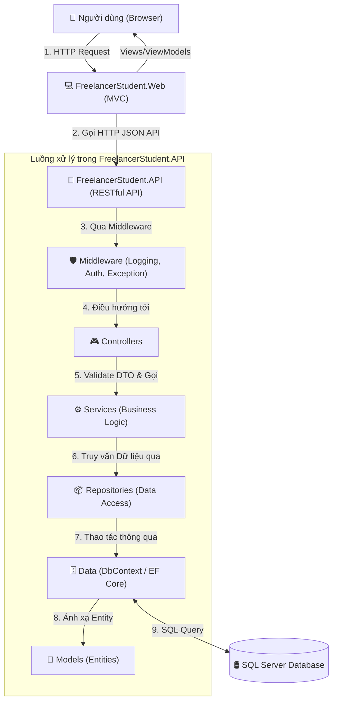
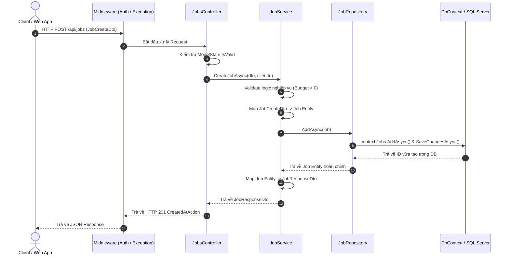
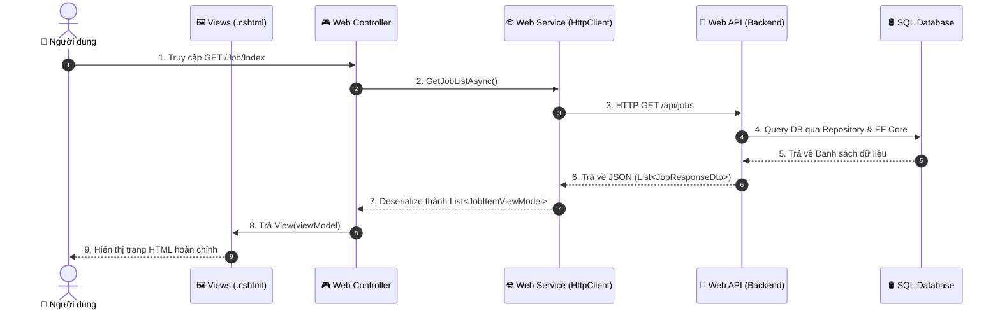

# 📚 HƯỚNG DẪN TOÀN DIỆN VỀ KIẾN TRÚC PROJECT VÀ LUỒNG XỬ LÝ CRUD (FREELANCERSTUDENT)

Tài liệu này được biên soạn nhằm giải thích chi tiết, cặn kẽ cấu trúc thư mục, trách nhiệm từng thành phần, luồng dữ liệu và toàn bộ kiến thức cần thiết để thực hiện các thao tác **CRUD (Create - Read - Update - Delete)** trong dự án **FreelancerStudent**.

---

## 📑 MỤC LỤC
1. [Tổng quan Kiến trúc Hệ thống](#1-tổng-quan-kiến-trúc-hệ-thống)
2. [Phần 1: Giải thích Chi tiết các Folder trong FreelancerStudent.API](#2-phần-1-giải-thích-chi-tiết-các-folder-trong-freelancerstudentapi)
   - [2.1. Models (Entities)](#21-models-entities)
   - [2.2. Data (DbContext & Configurations)](#22-data-dbcontext--configurations)
   - [2.3. Repositories (Data Access Layer)](#23-repositories-data-access-layer)
   - [2.4. Services (Business Logic Layer)](#24-services-business-logic-layer)
   - [2.5. DTOs (Data Transfer Objects)](#25-dtos-data-transfer-objects)
   - [2.6. Controllers (API Endpoints)](#26-controllers-api-endpoints)
   - [2.7. Helper (Utilities & Mappers)](#27-helper-utilities--mappers)
   - [2.8. Middleware (Request Pipeline & Global Exception)](#28-middleware-request-pipeline--global-exception)
   - [2.9. Sơ đồ Luồng hoạt động hoàn chỉnh của API](#29-sơ-đồ-luồng-hoạt-động-hoàn-chỉnh-của-api)
3. [Phần 2: Giải thích Chi tiết các Folder trong FreelancerStudent.Web (Client / MVC)](#3-phần-2-giải-thích-chi-tiết-các-folder-trong-freelancerstudentweb-client--mvc)
   - [3.1. Phân biệt API vs Web MVC](#31-phân-biệt-api-vs-web-mvc)
   - [3.2. Controllers (Web MVC Controller)](#32-controllers-web-mvc-controller)
   - [3.3. Services (Http Client Services)](#33-services-http-client-services)
   - [3.4. ViewModels (Giao diện Models)](#34-viewmodels-giao-diện-models)
   - [3.5. Views (Razor Pages .cshtml)](#35-views-razor-pages-cshtml)
   - [3.6. Sơ đồ Luồng hoạt động End-to-End (Web -> API -> Database)](#36-sơ-đồ-luồng-hoạt-động-end-to-end-web---api---database)
4. [Phần 3: Toàn bộ Kiến thức Cần có để Lấy Dữ liệu & Xử lý CRUD](#4-phần-3-toàn-bộ-kiến-thức-cần-có-để-lấy-dữ-liệu--xử-lý-crud)
   - [4.1. Kiến thức theo từng tầng công nghệ](#41-kiến-thức-theo-từng-tầng-công-nghệ)
   - [4.2. Bảng phân tích chi tiết 5 thao tác CRUD](#42-bảng-phân-tích-chi-tiết-5-thao-tác-crud)
   - [4.3. Ví dụ Code Thực tế Xuyên Suốt Toàn Bộ Dự Án (Nghiệp vụ Quản lý Job)](#43-ví-dụ-code-thực-tế-xuyên-suốt-toàn-bộ-dự-án-nghiệp-vụ-quản-lý-job)

---

## 1. Tổng quan Kiến trúc Hệ thống

Dự án được thiết kế theo mô hình **Tách biệt Frontend (Web MVC / Client) và Backend (RESTful Web API)** kết hợp kiến trúc phân tầng chuẩn (**N-Tier / Clean Architecture**):



---

## 2. Phần 1: Giải thích Chi tiết các Folder trong `FreelancerStudent.API`

### 2.1. Models (Entities)
- **Khái niệm:** Chứa các class C# đại diện trực tiếp cho các **Bảng (Tables)** trong Database.
- **Nhiệm vụ:**
  - Định nghĩa các cột (Properties), kiểu dữ liệu (`int`, `string`, `decimal`, `DateTime`).
  - Định nghĩa các quan hệ (Navigation Properties: 1-1, 1-N, N-N).
  - Sử dụng Data Annotations (như `[Key]`, `[ForeignKey]`, `[Table]`) để ánh xạ với CSDL.
- **Ví dụ cụ thể:**
```csharp
namespace FreelancerStudent.API.Models
{
    public class Job
    {
        public int Id { get; set; }
        public string Title { get; set; } = string.Empty;
        public string Description { get; set; } = string.Empty;
        public decimal Budget { get; set; }
        public DateTime CreatedAt { get; set; } = DateTime.UtcNow;
        public int CategoryId { get; set; }
        public int ClientId { get; set; }
        
        // Navigation Properties (Khóa ngoại)
        public virtual Category? Category { get; set; }
        public virtual User? Client { get; set; }
    }
}
```

---

### 2.2. Data (DbContext & Configurations) - Chuyên sâu về `OnModelCreating` và `modelBuilder`
- **Khái niệm:** Tầng kết nối giữa ứng dụng C# và CSDL, sử dụng **Entity Framework Core (EF Core)**.
- **Nhiệm vụ:**
  - Chứa file `ApplicationDbContext` kế thừa từ `DbContext`.
  - Khai báo các `DbSet<T>` tương ứng với từng bảng trong SQL.
  - Sử dụng phương thức **`OnModelCreating`** và đối tượng **`modelBuilder` (Fluent API)** để cấu hình toàn bộ quy tắc CSDL, quan hệ giữa các bảng, khóa chính/ngoại, index và dữ liệu mẫu.

---

#### 🧠 1. `OnModelCreating` là gì? Khi nào nó được gọi?
- **Định nghĩa:** `OnModelCreating(ModelBuilder modelBuilder)` là một phương thức ảo (`virtual`) được cung cấp sẵn bởi class cha `DbContext`.
- **Cơ chế hoạt động:** 
  - EF Core sẽ tự động gọi phương thức này **đúng 1 lần duy nhất** khi ứng dụng khởi động và lần đầu tiên kết nối vào CSDL để **xây dựng sơ đồ dữ liệu trong bộ nhớ (In-Memory Model Metadata)**.
  - Lệnh `base.OnModelCreating(modelBuilder);` ở dòng đầu tiên là bắt buộc để áp dụng tất cả các cấu hình mặc định từ class cha (đặc biệt quan trọng khi tích hợp ASP.NET Core Identity).

---

#### 🛠️ 2. `modelBuilder` (Fluent API) là gì? Tại sao phải dùng nó?
- **`modelBuilder`** là đối tượng trung tâm cung cấp bộ công cụ **Fluent API** (phương pháp cấu hình bằng chuỗi các hàm nối tiếp nhau `.HasKey().IsRequired().HasMaxLength()`).
- **So sánh giữa Fluent API (`modelBuilder`) và Data Annotations (`[Key]`, `[Required]`):**

| Tiêu chí | Data Annotations (Đặt `[...]` trên Model) | Fluent API (`modelBuilder` trong DbContext) |
| :--- | :--- | :--- |
| **Vị trí viết** | Đặt trực tiếp phía trên các thuộc tính trong Model | Tập trung toàn bộ trong file `ApplicationDbContext.cs` |
| **Độ sạch của Code** | Làm Model bị dài dòng, phụ thuộc vào thư viện EF Core | **Clean Code**: Model thuần túy chỉ chứa dữ liệu (POCO), không bị phụ thuộc |
| **Khả năng cấu hình** | Bị giới hạn (không tạo được khóa chính phức hợp, khó cấu hình quan hệ phức tạp) | **Mạnh mẽ nhất (100%)**: Cấu hình được mọi tính năng nâng cao của SQL Server |
| **Độ ưu tiên (Priority)** | Mức ưu tiên thấp hơn | **Ưu tiên cao nhất**: Nếu có xung đột, cấu hình trong `modelBuilder` sẽ đè lên Data Annotations |

---

#### 📚 3. Tổng hợp các cú pháp cốt lõi của `modelBuilder` cần nắm vững:

##### a. Cấu hình Bảng & Khóa chính (Table & Primary Key)
```csharp
// Đặt tên bảng trong SQL Server
modelBuilder.Entity<Users>().ToTable("Users");

// Khóa chính đơn (Single Primary Key)
modelBuilder.Entity<Users>().HasKey(u => u.maUser);

// Khóa chính phức hợp gồm 2 cột trở lên (Composite Primary Key - Data Annotations không làm được)
modelBuilder.Entity<FreelancerYeuThich>()
            .HasKey(f => new { f.maNhaTuyenDung, f.maFreelancerStudent });
```

##### b. Cấu hình Cột, Ràng buộc & Unique Index (Properties & Constraints)
```csharp
modelBuilder.Entity<Users>(entity =>
{
    // Bắt buộc (NOT NULL) và độ dài tối đa NVARCHAR(100)
    entity.Property(u => u.hotenUser)
          .IsRequired()
          .HasMaxLength(100);

    // Kiểu dữ liệu số thực tiền tệ DECIMAL(18,2) và giá trị mặc định = 0
    entity.Property(u => u.soDu)
          .HasColumnType("decimal(18,2)")
          .HasDefaultValue(0);

    // Giá trị ngày tạo mặc định lấy giờ hiện tại của SQL Server
    entity.Property(u => u.ngayTao)
          .HasDefaultValueSql("GETDATE()");

    // Ràng buộc DUY NHẤT (UNIQUE INDEX): Không cho phép trùng Email hoặc Username
    entity.HasIndex(u => u.emailUser).IsUnique();
    entity.HasIndex(u => u.tenTaiKhoanUser).IsUnique();
});
```

##### c. Cấu hình Quan hệ giữa các bảng (Relationships)
`modelBuilder` giúp EF Core hiểu chính xác mối liên kết giữa các bảng:

* **Quan hệ 1 - Nhiều (1-to-Many): 1 Role có Nhiều Users**
```csharp
modelBuilder.Entity<Users>()
    .HasOne(u => u.Role)                 // 1 User chỉ thuộc về 1 Role
    .WithMany(r => r.User)               // 1 Role có danh sách nhiều Users
    .HasForeignKey(u => u.maRole)        // Cột khóa ngoại nằm ở bảng Users là maRole
    .OnDelete(DeleteBehavior.Restrict);  // Quy tắc khi xóa (Xem giải thích bên dưới)
```

* **Quan hệ 1 - 1 (1-to-1): 1 User có 1 Ví tiền (Wallet)**
```csharp
modelBuilder.Entity<Wallet>()
    .HasOne(w => w.User)
    .WithOne(u => u.Wallet)
    .HasForeignKey<Wallet>(w => w.maUser) // Chỉ định rõ khóa ngoại nằm ở bảng Wallet
    .OnDelete(DeleteBehavior.Cascade);
```

##### d. Cấu hình Quy tắc Xóa (`OnDelete` / `DeleteBehavior`)
| Hành vi (`DeleteBehavior`) | Ý nghĩa và Trường hợp sử dụng |
| :--- | :--- |
| **`DeleteBehavior.Restrict`** *(Khuyên dùng)* | **Chặn không cho xóa cha** nếu còn dữ liệu con. Ví dụ: Không cho xóa `Role` nếu vẫn còn `Users` đang mang quyền đó. Tránh làm hỏng toàn vẹn dữ liệu. |
| **`DeleteBehavior.Cascade`** | **Xóa dây chuyền**: Xóa bản ghi cha thì toàn bộ bản ghi con liên quan bị xóa sạch theo. Ví dụ: Xóa `User` ➔ Tự động xóa luôn `Wallet` và `Profile` của User đó. |
| **`DeleteBehavior.SetNull`** | Xóa bản ghi cha ➔ Cột khóa ngoại ở bản ghi con tự động chuyển thành `NULL`. (Chỉ áp dụng cho cột khóa ngoại cho phép null). |

##### e. Nạp sẵn Dữ liệu Mẫu vào Database (`Seed Data`)
Dùng `modelBuilder.Entity<T>().HasData(...)` để tự động chèn sẵn dữ liệu cố định (như danh sách quyền Roles) ngay khi tạo database:
```csharp
modelBuilder.Entity<Roles>().HasData(
    new Roles { maRole = 1, tenRole = "FreelancerStudent" },
    new Roles { maRole = 2, tenRole = "NhaTuyenDung" },
    new Roles { maRole = 3, tenRole = "Admin" }
);
```

---

#### 💻 4. Ví dụ Code hoàn chỉnh của `ApplicationDbContext.cs`:
```csharp
using Microsoft.EntityFrameworkCore;
using FreelancerStudent.API.Models;

namespace FreelancerStudent.API.Data
{
    public class ApplicationDbContext : DbContext
    {
        public ApplicationDbContext(DbContextOptions<ApplicationDbContext> options) : base(options)
        {
        }

        // Khai báo các DbSet đại diện cho các bảng
        public DbSet<Users> Users { get; set; }
        public DbSet<Roles> Roles { get; set; }
        public DbSet<FreelancerStudents> FreelancerStudents { get; set; }
        public DbSet<Admin> Admins { get; set; }
        public DbSet<ChuyenNganh> ChuyenNganhs { get; set; }
        public DbSet<KyNang> KyNangs { get; set; }

        protected override void OnModelCreating(ModelBuilder modelBuilder)
        {
            base.OnModelCreating(modelBuilder);

            // 1. Cấu hình bảng Roles
            modelBuilder.Entity<Roles>(entity =>
            {
                entity.ToTable("Roles");
                entity.HasKey(r => r.maRole);
                entity.Property(r => r.tenRole).IsRequired().HasMaxLength(30);

                // Seed data mẫu
                entity.HasData(
                    new Roles { maRole = 1, tenRole = "FreelancerStudent" },
                    new Roles { maRole = 2, tenRole = "NhaTuyenDung" },
                    new Roles { maRole = 3, tenRole = "Admin" }
                );
            });

            // 2. Cấu hình bảng Users
            modelBuilder.Entity<Users>(entity =>
            {
                entity.ToTable("Users");
                entity.HasKey(u => u.maUser);
                
                entity.Property(u => u.hotenUser).IsRequired().HasMaxLength(100);
                entity.Property(u => u.tenTaiKhoanUser).IsRequired().HasMaxLength(30);
                entity.Property(u => u.emailUser).IsRequired().HasMaxLength(100);
                entity.Property(u => u.pashWordHash).IsRequired().HasMaxLength(255);
                entity.Property(u => u.status).IsRequired().HasMaxLength(20).HasDefaultValue("ACTIVE");
                entity.Property(u => u.ngayTao).HasDefaultValueSql("GETDATE()");

                // Unique Constraint
                entity.HasIndex(u => u.emailUser).IsUnique();
                entity.HasIndex(u => u.tenTaiKhoanUser).IsUnique();

                // Quan hệ 1-N với Roles
                entity.HasOne(u => u.Role)
                      .WithMany(r => r.User)
                      .HasForeignKey(u => u.maRole)
                      .OnDelete(DeleteBehavior.Restrict);
            });
        }
    }
}
```

---

### 2.3. Repositories (Data Access Layer)
- **Khái niệm:** Thực hiện mẫu thiết kế **Repository Pattern** để tách biệt hoàn toàn tầng logic nghiệp vụ khỏi tầng truy cập dữ liệu trực tiếp (`DbContext`).
- **Nhiệm vụ:**
  - Chứa `IRepository<T>` (Interface) và `Repository<T>` (Class thực thi).
  - Chứa các phương thức CRUD cơ bản: `GetAllAsync()`, `GetByIdAsync()`, `AddAsync()`, `UpdateAsync()`, `DeleteAsync()`.
  - Thực hiện các truy vấn LINQ phức tạp, Include bảng liên quan, lọc dữ liệu.
- **Ví dụ cụ thể:**
```csharp
// Interface
public interface IJobRepository
{
    Task<IEnumerable<Job>> GetAllAsync();
    Task<Job?> GetByIdAsync(int id);
    Task<IEnumerable<Job>> GetJobsByCategoryAsync(int categoryId);
    Task AddAsync(Job job);
    Task UpdateAsync(Job job);
    Task DeleteAsync(int id);
}

// Implementation
public class JobRepository : IJobRepository
{
    private readonly ApplicationDbContext _context;

    public JobRepository(ApplicationDbContext context)
    {
        _context = context;
    }

    public async Task<IEnumerable<Job>> GetAllAsync()
    {
        return await _context.Jobs
            .Include(j => j.Category)
            .Include(j => j.Client)
            .AsNoTracking()
            .ToListAsync();
    }

    public async Task<Job?> GetByIdAsync(int id)
    {
        return await _context.Jobs
            .Include(j => j.Category)
            .Include(j => j.Client)
            .FirstOrDefaultAsync(j => j.Id == id);
    }

    public async Task AddAsync(Job job)
    {
        await _context.Jobs.AddAsync(job);
        await _context.SaveChangesAsync();
    }

    public async Task UpdateAsync(Job job)
    {
        _context.Jobs.Update(job);
        await _context.SaveChangesAsync();
    }

    public async Task DeleteAsync(int id)
    {
        var job = await _context.Jobs.FindAsync(id);
        if (job != null)
        {
            _context.Jobs.Remove(job);
            await _context.SaveChangesAsync();
        }
    }
}
```

---

### 2.4. Services (Business Logic Layer)
- **Khái niệm:** Trái tim của hệ thống Backend, chứa toàn bộ **Logic Nghiệp vụ (Business Rules)**.
- **Nhiệm vụ:**
  - Nhận dữ liệu DTO từ Controller.
  - Kiểm tra tính hợp lệ về mặt nghiệp vụ (ví dụ: Budget phải > 0, ngày hết hạn phải sau ngày tạo, kiểm tra user có quyền sửa job không).
  - Gọi Repository để lấy hoặc lưu Entity.
  - Chuyển đổi qua lại giữa `Entity <-> DTO`.
  - Trả về kết quả đã xử lý cho Controller.
- **Ví dụ cụ thể:**
```csharp
public interface IJobService
{
    Task<IEnumerable<JobResponseDto>> GetAllJobsAsync();
    Task<JobResponseDto?> GetJobByIdAsync(int id);
    Task<JobResponseDto> CreateJobAsync(JobCreateDto dto, int clientId);
    Task<bool> UpdateJobAsync(int id, JobUpdateDto dto, int currentUserId);
    Task<bool> DeleteJobAsync(int id, int currentUserId);
}

public class JobService : IJobService
{
    private readonly IJobRepository _jobRepo;

    public JobService(IJobRepository jobRepo)
    {
        _jobRepo = jobRepo;
    }

    public async Task<IEnumerable<JobResponseDto>> GetAllJobsAsync()
    {
        var jobs = await _jobRepo.GetAllAsync();
        return jobs.Select(j => new JobResponseDto
        {
            Id = j.Id,
            Title = j.Title,
            Description = j.Description,
            Budget = j.Budget,
            CategoryName = j.Category?.Name ?? "Chưa phân loại",
            ClientName = j.Client?.FullName ?? "N/A",
            CreatedAt = j.CreatedAt
        });
    }

    public async Task<JobResponseDto> CreateJobAsync(JobCreateDto dto, int clientId)
    {
        // 1. Kiểm tra nghiệp vụ
        if (dto.Budget <= 0)
            throw new ArgumentException("Ngân sách công việc phải lớn hơn 0!");

        // 2. Chuyển DTO -> Entity
        var job = new Job
        {
            Title = dto.Title,
            Description = dto.Description,
            Budget = dto.Budget,
            CategoryId = dto.CategoryId,
            ClientId = clientId,
            CreatedAt = DateTime.UtcNow
        };

        // 3. Lưu vào Database thông qua Repository
        await _jobRepo.AddAsync(job);

        // 4. Trả về DTO kết quả
        return new JobResponseDto
        {
            Id = job.Id,
            Title = job.Title,
            Description = job.Description,
            Budget = job.Budget,
            CreatedAt = job.CreatedAt
        };
    }
}
```

---

### 2.5. DTOs (Data Transfer Objects)
- **Khái niệm:** Đối tượng dùng để vận chuyển dữ liệu qua mạng giữa Client và API.
- **Tại sao không dùng trực tiếp Model/Entity?**
  1. **Bảo mật (Security):** Tránh lộ các trường nhạy cảm như `PasswordHash`, `Token`, `IsAdmin`. Tránh lỗ hổng Over-Posting.
  2. **Tối ưu hiệu năng:** Chỉ gửi những trường mà Client cần, tránh payload JSON quá lớn.
  3. **Tránh lỗi vòng lặp JSON:** Khi 2 bảng quan hệ 2 chiều (`Job` có `Category`, `Category` có `List<Job>`), nếu serialize Entity sẽ bị lỗi `JsonException: A possible object cycle was detected`.
  4. **Validation riêng biệt:** Request tạo mới có quy tắc khác với Request cập nhật.
- **Phân loại DTOs:**
  - **Request DTO:** Dữ liệu nhận từ Client gửi lên (ví dụ: `JobCreateDto`, `JobUpdateDto`, `LoginRequestDto`).
  - **Response DTO:** Dữ liệu API đóng gói trả về cho Client (ví dụ: `JobResponseDto`, `ApiResponse<T>`).
- **Ví dụ cụ thể:**
```csharp
// DTO nhận dữ liệu tạo mới Job
public class JobCreateDto
{
    [Required(ErrorMessage = "Tiêu đề không được để trống")]
    [StringLength(200, MinimumLength = 10, ErrorMessage = "Tiêu đề từ 10 - 200 ký tự")]
    public string Title { get; set; } = string.Empty;

    [Required(ErrorMessage = "Mô tả công việc không được để trống")]
    public string Description { get; set; } = string.Empty;

    [Range(10000, 1000000000, ErrorMessage = "Ngân sách từ 10,000đ đến 1,000,000,000đ")]
    public decimal Budget { get; set; }

    [Required(ErrorMessage = "Vui lòng chọn danh mục")]
    public int CategoryId { get; set; }
}

// DTO trả dữ liệu hiển thị ra ngoài
public class JobResponseDto
{
    public int Id { get; set; }
    public string Title { get; set; } = string.Empty;
    public string Description { get; set; } = string.Empty;
    public decimal Budget { get; set; }
    public string CategoryName { get; set; } = string.Empty;
    public string ClientName { get; set; } = string.Empty;
    public DateTime CreatedAt { get; set; }
}
```

---

### 2.6. Controllers (API Endpoints)
- **Khái niệm:** Cổng giao tiếp ngoại vi của API, nhận HTTP Requests (`GET`, `POST`, `PUT`, `DELETE`) từ Client và trả về HTTP Responses (kèm Status Code chuẩn như 200, 201, 400, 404, 500).
- **Nguyên tắc vàng:** **Controller phải mỏng (Thin Controller)** — Controller không chứa logic tính toán, không truy vấn database trực tiếp, chỉ làm nhiệm vụ:
  1. Nhận Request & Validate Model State.
  2. Lấy thông tin User hiện tại từ Claims/Token (nếu có).
  3. Gọi Service tương ứng.
  4. Trả về `ActionResult` chuẩn RESTful (`Ok`, `CreatedAtAction`, `BadRequest`, `NotFound`).
- **Ví dụ cụ thể:**
```csharp
[ApiController]
[Route("api/[controller]")]
public class JobsController : ControllerBase
{
    private readonly IJobService _jobService;

    public JobsController(IJobService jobService)
    {
        _jobService = jobService;
    }

    // GET: api/jobs
    [HttpGet]
    public async Task<IActionResult> GetAll()
    {
        var result = await _jobService.GetAllJobsAsync();
        return Ok(result); // Trả về HTTP 200 OK + JSON
    }

    // GET: api/jobs/5
    [HttpGet("{id}")]
    public async Task<IActionResult> GetById(int id)
    {
        var job = await _jobService.GetJobByIdAsync(id);
        if (job == null) return NotFound(new { message = $"Không tìm thấy Job có ID = {id}" });
        return Ok(job);
    }

    // POST: api/jobs
    [HttpPost]
    [Authorize] // Yêu cầu đăng nhập
    public async Task<IActionResult> Create([FromBody] JobCreateDto dto)
    {
        if (!ModelState.IsValid)
            return BadRequest(ModelState); // Trả về HTTP 400 kèm lỗi validate

        int currentUserId = int.Parse(User.FindFirst(ClaimTypes.NameIdentifier)!.Value);
        var createdJob = await _jobService.CreateJobAsync(dto, currentUserId);
        
        return CreatedAtAction(nameof(GetById), new { id = createdJob.Id }, createdJob); // Trả về HTTP 201 Created
    }

    // DELETE: api/jobs/5
    [HttpDelete("{id}")]
    [Authorize]
    public async Task<IActionResult> Delete(int id)
    {
        int currentUserId = int.Parse(User.FindFirst(ClaimTypes.NameIdentifier)!.Value);
        var success = await _jobService.DeleteJobAsync(id, currentUserId);
        if (!success) return BadRequest(new { message = "Xóa không thành công hoặc không có quyền" });
        
        return NoContent(); // Trả về HTTP 204 No Content
    }
}
```

---

### 2.7. Helper (Utilities & Mappers)
- **Khái niệm:** Chứa các hàm tiện ích tái sử dụng, mapper đối tượng, bảo mật hoặc định dạng dữ liệu dùng chung trong toàn bộ API.
- **Các thành phần phổ biến trong Helper:**
  - `MappingProfile` (nếu dùng AutoMapper): Tự động map giữa Entity và DTO.
  - `JwtHelper`: Tạo token, giải mã token, lấy Claims.
  - `ApiResponse<T>`: Chuẩn hóa định dạng JSON trả về thống nhất (`{ success: true, data: ..., message: ... }`).
  - `PaginationHelper`: Hỗ trợ phân trang danh sách.
  - `PasswordHasher`: Mã hóa mật khẩu (BCrypt hoặc PBKDF2).
- **Ví dụ cụ thể:**
```csharp
public class ApiResponse<T>
{
    public bool Success { get; set; }
    public string Message { get; set; } = string.Empty;
    public T? Data { get; set; }
    public List<string>? Errors { get; set; }

    public static ApiResponse<T> Ok(T data, string message = "Thành công") 
        => new ApiResponse<T> { Success = true, Message = message, Data = data };

    public static ApiResponse<T> Fail(string message, List<string>? errors = null) 
        => new ApiResponse<T> { Success = false, Message = message, Errors = errors };
}
```

---

### 2.8. Middleware (Request Pipeline & Global Exception)
- **Khái niệm:** Các thành phần phần mềm được gắn vào **đường ống xử lý HTTP Request (Pipeline)** của ASP.NET Core để kiểm tra, can thiệp hoặc xử lý trước khi Request đến Controller và sau khi Response rời khỏi Controller.
- **Các nhiệm vụ tiêu biểu:**
  1. **Global Exception Handling Middleware:** Bắt toàn bộ lỗi (Crash, Exception) trong toàn bộ ứng dụng mà không cần viết `try-catch` lặp lại ở mọi Controller, log lỗi và trả về JSON chuẩn HTTP 500 đẹp mắt.
  2. **JwtAuthenticationMiddleware:** Kiểm tra token, xử lý xác thực.
  3. **RequestLoggingMiddleware:** Ghi log thời gian thực thi của mỗi Request.
- **Ví dụ cụ thể:**
```csharp
public class GlobalExceptionMiddleware
{
    private readonly RequestDelegate _next;
    private readonly ILogger<GlobalExceptionMiddleware> _logger;

    public GlobalExceptionMiddleware(RequestDelegate next, ILogger<GlobalExceptionMiddleware> logger)
    {
        _next = next;
        _logger = logger;
    }

    public async Task InvokeAsync(HttpContext context)
    {
        try
        {
            await _next(context); // Chuyển tiếp sang tầng tiếp theo
        }
        catch (Exception ex)
        {
            _logger.LogError(ex, "Đã xảy ra lỗi không mong muốn: {Message}", ex.Message);
            await HandleExceptionAsync(context, ex);
        }
    }

    private static Task HandleExceptionAsync(HttpContext context, Exception ex)
    {
        context.Response.ContentType = "application/json";
        context.Response.StatusCode = (int)HttpStatusCode.InternalServerError;

        var response = new
        {
            success = false,
            message = "Đã xảy ra lỗi trên máy chủ. Vui lòng thử lại sau!",
            detail = ex.Message // Chỉ bật ở môi trường Development
        };

        return context.Response.WriteAsync(JsonSerializer.Serialize(response));
    }
}
```

---

### 2.9. Sơ đồ Luồng hoạt động hoàn chỉnh của API



---

## 3. Phần 2: Giải thích Chi tiết các Folder trong `FreelancerStudent.Web` (Client / MVC)

### 3.1. Phân biệt API vs Web MVC
> [!NOTE]
> - **FreelancerStudent.API:** Là **Backend**, chỉ tiếp nhận dữ liệu và trả về JSON thuần túy, hoàn toàn **không có giao diện** HTML hay Razor Views.
> - **FreelancerStudent.Web:** Là **Frontend / Web Application (MVC)**, làm nhiệm vụ hiển thị giao diện người dùng (HTML, CSS, JS, Razor), gọi API Backend để lấy dữ liệu và render giao diện.

---

### 3.2. Controllers (Web MVC Controller)
- **Khái niệm:** Kế thừa từ class `Microsoft.AspNetCore.Mvc.Controller`.
- **Nhiệm vụ:**
  - Nhận yêu cầu điều hướng trang từ Browser của người dùng (ví dụ: vào trang `localhost:5001/Job/Index` hoặc `localhost:5001/Job/Create`).
  - Gọi tầng `Services` (Web Client Service) để lấy dữ liệu từ API.
  - Chuẩn bị dữ liệu và truyền sang `View` thông qua `ViewModel`.
  - Nhận dữ liệu submit từ Form (POST), gọi API để lưu và chuyển hướng (`RedirectToAction`).
- **Ví dụ cụ thể:**
```csharp
public class JobController : Controller
{
    private readonly IJobWebService _jobWebService;

    public JobController(IJobWebService jobWebService)
    {
        _jobWebService = jobWebService;
    }

    // GET: /Job/Index
    public async Task<IActionResult> Index()
    {
        // 1. Gọi service để lấy dữ liệu từ API
        var jobs = await _jobWebService.GetJobListAsync();
        
        // 2. Truyền danh sách sang Razor View
        return View(jobs);
    }

    // GET: /Job/Create (Hiển thị Form)
    [HttpGet]
    public async Task<IActionResult> Create()
    {
        var viewModel = new JobCreateViewModel
        {
            Categories = await _jobWebService.GetCategoryDropdownAsync()
        };
        return View(viewModel);
    }

    // POST: /Job/Create (Xử lý khi bấm nút Submit Form)
    [HttpPost]
    [ValidateAntiForgeryToken]
    public async Task<IActionResult> Create(JobCreateViewModel model)
    {
        if (!ModelState.IsValid)
        {
            model.Categories = await _jobWebService.GetCategoryDropdownAsync();
            return View(model); // Trả lại Form kèm thông báo lỗi
        }

        var isSuccess = await _jobWebService.CreateJobAsync(model);
        if (isSuccess)
        {
            TempData["SuccessMessage"] = "Đăng tin tuyển dụng thành công!";
            return RedirectToAction(nameof(Index));
        }

        ModelState.AddModelError("", "Đăng tin thất bại từ máy chủ API!");
        model.Categories = await _jobWebService.GetCategoryDropdownAsync();
        return View(model);
    }
}
```

---

### 3.3. Services (Http Client Services)
- **Khái niệm:** Tầng chịu trách nhiệm đóng vai trò **Client gửi yêu cầu HTTP** (`HttpClient`) từ Web MVC sang `FreelancerStudent.API`.
- **Nhiệm vụ:**
  - Cấu hình BaseUrl của API, gán Header Bearer Token.
  - Serialize dữ liệu C# ViewModel thành JSON gửi đi.
  - Nhận JSON phản hồi từ API và Deserialize thành C# Object / ViewModel.
  - Bắt lỗi mạng hoặc lỗi HTTP (400, 401, 403, 500) và thông báo cho Controller.
- **Ví dụ cụ thể:**
```csharp
public interface IJobWebService
{
    Task<List<JobItemViewModel>> GetJobListAsync();
    Task<bool> CreateJobAsync(JobCreateViewModel model);
    Task<List<SelectListItem>> GetCategoryDropdownAsync();
}

public class JobWebService : IJobWebService
{
    private readonly HttpClient _httpClient;

    public JobWebService(HttpClient httpClient)
    {
        _httpClient = httpClient;
    }

    public async Task<List<JobItemViewModel>> GetJobListAsync()
    {
        var response = await _httpClient.GetAsync("api/jobs");
        if (response.IsSuccessStatusCode)
        {
            var content = await response.Content.ReadAsStringAsync();
            return JsonSerializer.Deserialize<List<JobItemViewModel>>(content, new JsonSerializerOptions { PropertyNameCaseInsensitive = true }) ?? new();
        }
        return new List<JobItemViewModel>();
    }

    public async Task<bool> CreateJobAsync(JobCreateViewModel model)
    {
        var jsonContent = new StringContent(JsonSerializer.Serialize(model), Encoding.UTF8, "application/json");
        var response = await _httpClient.PostAsync("api/jobs", jsonContent);
        return response.IsSuccessStatusCode;
    }

    public async Task<List<SelectListItem>> GetCategoryDropdownAsync()
    {
        var response = await _httpClient.GetAsync("api/categories");
        if (response.IsSuccessStatusCode)
        {
            var data = await response.Content.ReadFromJsonAsync<List<CategoryDto>>();
            return data?.Select(c => new SelectListItem { Value = c.Id.ToString(), Text = c.Name }).ToList() ?? new();
        }
        return new();
    }
}
```

---

### 3.4. ViewModels (Giao diện Models)
- **Khái niệm:** Model được thiết kế chuyên biệt để phục vụ cho **Một Màn hình / Một Giao diện (View)** cụ thể.
- **Tại sao cần ViewModel?**
  - Giao diện thường cần nhiều hơn 1 đối tượng: Form tạo Job cần cả thông tin nhập (`Title`, `Budget`) VÀ danh sách chọn dropdown (`List<SelectListItem> Categories`).
  - Gắn các Data Annotations để hiển thị thông báo lỗi trực tiếp trên giao diện người dùng (`[Required(ErrorMessage="...")]`).
- **Ví dụ cụ thể:**
```csharp
public class JobCreateViewModel
{
    [Required(ErrorMessage = "Vui lòng nhập tiêu đề công việc")]
    [Display(Name = "Tiêu đề công việc")]
    public string Title { get; set; } = string.Empty;

    [Required(ErrorMessage = "Vui lòng nhập mô tả chi tiết")]
    [Display(Name = "Mô tả công việc")]
    public string Description { get; set; } = string.Empty;

    [Required(ErrorMessage = "Vui lòng nhập ngân sách")]
    [Display(Name = "Ngân sách dự kiến (VNĐ)")]
    public decimal Budget { get; set; }

    [Required(ErrorMessage = "Vui lòng chọn danh mục")]
    [Display(Name = "Danh mục")]
    public int CategoryId { get; set; }

    // Chứa dữ liệu đổ vào thẻ <select> dropdown
    public List<SelectListItem> Categories { get; set; } = new();
}
```

---

### 3.5. Views (Razor Pages `.cshtml`)
- **Khái niệm:** Các file template giao diện kết hợp giữa **HTML5, CSS, Bootstrap/Tailwind** và mã nguồn **C# (Cú pháp Razor `@`)**.
- **Nhiệm vụ:**
  - Nhận dữ liệu mạnh kiểu (`@model JobCreateViewModel`).
  - Hiển thị danh sách, bảng dữ liệu, nút bấm.
  - Sử dụng Tag Helpers (`asp-for`, `asp-action`, `asp-controller`, `asp-validation-for`) để tự động binding dữ liệu 2 chiều giữa HTML Form và C# Model.
- **Ví dụ cụ thể (`Views/Job/Create.cshtml`):**
```html
@model FreelancerStudent.Web.ViewModels.JobCreateViewModel

@{
    ViewData["Title"] = "Đăng Tin Tuyển Dụng";
}

<div class="container mt-4">
    <h2>📝 Đăng Tin Tuyển Dụng Mới</h2>
    <hr />

    <form asp-controller="Job" asp-action="Create" method="post">
        <div asp-validation-summary="ModelOnly" class="text-danger mb-3"></div>

        <div class="mb-3">
            <label asp-for="Title" class="form-label font-weight-bold"></label>
            <input asp-for="Title" class="form-control" placeholder="Ví dụ: Thiết kế Website Bán Hàng..." />
            <span asp-validation-for="Title" class="text-danger"></span>
        </div>

        <div class="mb-3">
            <label asp-for="CategoryId" class="form-label font-weight-bold"></label>
            <select asp-for="CategoryId" asp-items="Model.Categories" class="form-select">
                <option value="">-- Chọn Danh Mục --</option>
            </select>
            <span asp-validation-for="CategoryId" class="text-danger"></span>
        </div>

        <div class="mb-3">
            <label asp-for="Budget" class="form-label font-weight-bold"></label>
            <input asp-for="Budget" type="number" class="form-control" />
            <span asp-validation-for="Budget" class="text-danger"></span>
        </div>

        <div class="mb-3">
            <label asp-for="Description" class="form-label font-weight-bold"></label>
            <textarea asp-for="Description" class="form-control" rows="5"></textarea>
            <span asp-validation-for="Description" class="text-danger"></span>
        </div>

        <button type="submit" class="btn btn-primary">🚀 Đăng Tin Ngay</button>
        <a asp-action="Index" class="btn btn-secondary">Quay lại</a>
    </form>
</div>

@section Scripts {
    @{await Html.RenderPartialAsync("_ValidationScriptsPartial");}
}
```

---

### 3.6. Sơ đồ Luồng hoạt động End-to-End (Web -> API -> Database)



---

## 4. Phần 3: Toàn bộ Kiến thức Cần có để Lấy Dữ liệu & Xử lý CRUD

Để có thể lấy tất cả dữ liệu từ Database qua để **Thêm (Create) - Đọc (Read) - Sửa (Update) - Xóa (Delete)** thành thạo, bạn cần nắm vững các mảng kiến thức tương ứng theo từng tầng sau:

### 4.1. Kiến thức theo từng tầng công nghệ

```
┌─────────────────────────────────────────────────────────────────────────────┐
│ 1. TẦNG DATABASE (SQL SERVER)                                              │
│    • Hiểu cấu trúc Bảng (Tables), Cột (Columns), Khóa chính (PK), Khóa ngoại(FK)│
│    • Hiểu quan hệ: 1-1, 1-Nhiều (1 Category - N Jobs), Nhiều-Nhiều         │
└─────────────────────────────────────────────────────────────────────────────┘
                                      ▲
                                      │
┌─────────────────────────────────────────────────────────────────────────────┐
│ 2. TẦNG DATA & ORM (ENTITY FRAMEWORK CORE)                                  │
│    • DbContext, DbSet<TEntity>                                              │
│    • Phương thức EF Core: AddAsync, Update, Remove, SaveChangesAsync         │
│    • Truy vấn LINQ: ToListAsync, FirstOrDefaultAsync, Where, Select, Include│
│    • Tối ưu AsNoTracking() cho thao tác Read (chỉ đọc dữ liệu)              │
└─────────────────────────────────────────────────────────────────────────────┘
                                      ▲
                                      │
┌─────────────────────────────────────────────────────────────────────────────┐
│ 3. TẦNG DATA ACCESS (REPOSITORY PATTERN)                                    │
│    • Khái niệm Interface (IRepository) và Implementation (Repository)        │
│    • Đóng gói các hàm CRUD để tái sử dụng và dễ dàng Unit Test              │
│    • Quản lý Transaction / Unit of Work (nếu thực hiện nhiều bảng cùng lúc) │
└─────────────────────────────────────────────────────────────────────────────┘
                                      ▲
                                      │
┌─────────────────────────────────────────────────────────────────────────────┐
│ 4. TẦNG BUSINESS LOGIC (SERVICE LAYER & DTOs)                               │
│    • Validation nghiệp vụ (Logic Check: số dư > 0, ngày hợp lệ, check tồn tại)│
│    • Mapping: Chuyển đổi DTO -> Entity (khi Create/Update)                   │
│               Chuyển đổi Entity -> DTO (khi Read)                           │
│    • Dependency Injection (DI): Khai báo AddScoped trong Program.cs          │
└─────────────────────────────────────────────────────────────────────────────┘
                                      ▲
                                      │
┌─────────────────────────────────────────────────────────────────────────────┐
│ 5. TẦNG API CONTROLLERS (RESTful API STANDARDS)                             │
│    • HTTP Verbs: GET (Read), POST (Create), PUT (Update), DELETE (Delete)   │
│    • Route Attributes: [HttpGet("{id}")], [HttpPost], [HttpPut("{id}")]      │
│    • Binding Sources: [FromBody], [FromQuery], [FromRoute]                  │
│    • HTTP Status Codes: 200 OK, 201 Created, 204 NoContent, 400 BadRequest,│
│                         401 Unauthorized, 404 NotFound, 500 ServerError     │
└─────────────────────────────────────────────────────────────────────────────┘
                                      ▲
                                      │
┌─────────────────────────────────────────────────────────────────────────────┐
│ 6. TẦNG CLIENT / WEB MVC (CONSUMING API & UI RENDERING)                     │
│    • HttpClient & IHttpClientFactory (Gửi Request, Headers, JSON Content)  │
│    • System.Text.Json (Serialize đối tượng sang JSON, Deserialize JSON)     │
│    • Razor Tag Helpers (asp-for, asp-action, asp-validation-for)           │
│    • Quản lý Trạng thái: TempData, ViewBag, ModelState                      │
└─────────────────────────────────────────────────────────────────────────────┘
```

---

### 4.2. Bảng phân tích chi tiết 5 thao tác CRUD

| Thao tác | HTTP Method & Route API | Thao tác EF Core / SQL | DTO / ViewModel liên quan | HTTP Status Code trả về |
| :--- | :--- | :--- | :--- | :--- |
| **1. Read All (Lấy danh sách)** | `GET /api/jobs` | `_context.Jobs.AsNoTracking().Include(...).ToListAsync()` | `List<JobResponseDto>` / `List<JobItemViewModel>` | `200 OK` |
| **2. Read One (Lấy chi tiết)** | `GET /api/jobs/{id}` | `_context.Jobs.FirstOrDefaultAsync(x => x.Id == id)` | `JobResponseDto` / `JobDetailViewModel` | `200 OK` hoặc `404 NotFound` |
| **3. Create (Thêm mới)** | `POST /api/jobs` | `_context.Jobs.AddAsync(job); await _context.SaveChangesAsync();` | `JobCreateDto` / `JobCreateViewModel` | `201 Created` (kèm Header Location) |
| **4. Update (Cập nhật)** | `PUT /api/jobs/{id}` | Tìm record cũ -> Gán giá trị mới -> `_context.SaveChangesAsync();` | `JobUpdateDto` / `JobEditViewModel` | `200 OK` hoặc `204 NoContent` |
| **5. Delete (Xóa)** | `DELETE /api/jobs/{id}` | Tìm record -> `_context.Jobs.Remove(job); await _context.SaveChangesAsync();` | `id` (Param) | `204 NoContent` hoặc `200 OK` |

---

### 4.3. Ví dụ Code Thực tế Xuyên Suốt Toàn Bộ Dự Án (Nghiệp vụ Quản lý Job)

Dưới đây là mã nguồn mẫu chi tiết cách triển khai trọn vẹn 1 tính năng CRUD qua tất cả các tầng:

#### Bước 1: Đăng ký Dependency Injection tại API `Program.cs`
```csharp
// Đăng ký DbContext
builder.Services.AddDbContext<ApplicationDbContext>(options =>
    options.UseSqlServer(builder.Configuration.GetConnectionString("DefaultConnection")));

// Đăng ký Repository & Service
builder.Services.AddScoped<IJobRepository, JobRepository>();
builder.Services.AddScoped<IJobService, JobService>();
```

#### Bước 2: Tầng Repository (`FreelancerStudent.API/Repositories/JobRepository.cs`)
```csharp
public class JobRepository : IJobRepository
{
    private readonly ApplicationDbContext _db;
    public JobRepository(ApplicationDbContext db) => _db = db;

    // READ ALL
    public async Task<IEnumerable<Job>> GetAllAsync() =>
        await _db.Jobs.Include(j => j.Category).AsNoTracking().ToListAsync();

    // READ BY ID
    public async Task<Job?> GetByIdAsync(int id) =>
        await _db.Jobs.Include(j => j.Category).FirstOrDefaultAsync(j => j.Id == id);

    // CREATE
    public async Task<Job> AddAsync(Job job)
    {
        await _db.Jobs.AddAsync(job);
        await _db.SaveChangesAsync();
        return job;
    }

    // UPDATE
    public async Task UpdateAsync(Job job)
    {
        _db.Jobs.Update(job);
        await _db.SaveChangesAsync();
    }

    // DELETE
    public async Task DeleteAsync(Job job)
    {
        _db.Jobs.Remove(job);
        await _db.SaveChangesAsync();
    }
}
```

#### Bước 3: Tầng Service (`FreelancerStudent.API/Services/JobService.cs`)
```csharp
public class JobService : IJobService
{
    private readonly IJobRepository _repo;
    public JobService(IJobRepository repo) => _repo = repo;

    public async Task<IEnumerable<JobResponseDto>> GetAllAsync()
    {
        var list = await _repo.GetAllAsync();
        return list.Select(x => new JobResponseDto {
            Id = x.Id,
            Title = x.Title,
            Budget = x.Budget,
            CategoryName = x.Category?.Name ?? "Chưa có"
        });
    }

    public async Task<JobResponseDto?> GetByIdAsync(int id)
    {
        var x = await _repo.GetByIdAsync(id);
        if (x == null) return null;
        return new JobResponseDto {
            Id = x.Id,
            Title = x.Title,
            Description = x.Description,
            Budget = x.Budget,
            CategoryName = x.Category?.Name ?? "Chưa có"
        };
    }

    public async Task<JobResponseDto> CreateAsync(JobCreateDto dto, int clientId)
    {
        var job = new Job
        {
            Title = dto.Title,
            Description = dto.Description,
            Budget = dto.Budget,
            CategoryId = dto.CategoryId,
            ClientId = clientId,
            CreatedAt = DateTime.UtcNow
        };
        await _repo.AddAsync(job);
        return new JobResponseDto { Id = job.Id, Title = job.Title, Budget = job.Budget };
    }

    public async Task<bool> UpdateAsync(int id, JobUpdateDto dto)
    {
        var existing = await _repo.GetByIdAsync(id);
        if (existing == null) return false;

        existing.Title = dto.Title;
        existing.Description = dto.Description;
        existing.Budget = dto.Budget;
        existing.CategoryId = dto.CategoryId;

        await _repo.UpdateAsync(existing);
        return true;
    }

    public async Task<bool> DeleteAsync(int id)
    {
        var existing = await _repo.GetByIdAsync(id);
        if (existing == null) return false;

        await _repo.DeleteAsync(existing);
        return true;
    }
}
```

#### Bước 4: Tầng Controller API (`FreelancerStudent.API/Controllers/JobsController.cs`)
```csharp
[ApiController]
[Route("api/[controller]")]
public class JobsController : ControllerBase
{
    private readonly IJobService _service;
    public JobsController(IJobService service) => _service = service;

    [HttpGet]
    public async Task<IActionResult> GetAll() => Ok(await _service.GetAllAsync());

    [HttpGet("{id}")]
    public async Task<IActionResult> GetById(int id)
    {
        var item = await _service.GetByIdAsync(id);
        return item != null ? Ok(item) : NotFound(new { message = "Không tìm thấy dữ liệu" });
    }

    [HttpPost]
    public async Task<IActionResult> Create([FromBody] JobCreateDto dto)
    {
        if (!ModelState.IsValid) return BadRequest(ModelState);
        var created = await _service.CreateAsync(dto, clientId: 1); // Giả lập clientId = 1
        return CreatedAtAction(nameof(GetById), new { id = created.Id }, created);
    }

    [HttpPut("{id}")]
    public async Task<IActionResult> Update(int id, [FromBody] JobUpdateDto dto)
    {
        if (!ModelState.IsValid) return BadRequest(ModelState);
        var success = await _service.UpdateAsync(id, dto);
        return success ? Ok(new { message = "Cập nhật thành công" }) : NotFound();
    }

    [HttpDelete("{id}")]
    public async Task<IActionResult> Delete(int id)
    {
        var success = await _service.DeleteAsync(id);
        return success ? NoContent() : NotFound();
    }
}
```

---

## 5. Quy Trình Chuẩn 6 Bước Xây Dựng Một Chức Năng Backend API (Thực Hành Thực Tế)

Dưới đây là cẩm nang 6 bước tuần tự, chuẩn mực để bạn xây dựng bất kỳ một tính năng API nào trong dự án **FreelancerStudent** (lấy chức năng **Đăng Ký Tài Khoản** làm ví dụ chuẩn mực):

```
┌────────────────────────────────────────────────────────────────────────┐
│ BƯỚC 1: Tạo DTOs (RequestDTO để nhận & ReponseDTO để trả về)           │
├────────────────────────────────────────────────────────────────────────┤
│ BƯỚC 2: Tạo Helper / Tiện ích dùng chung (PasswordHasher, BCrypt, ...) │
├────────────────────────────────────────────────────────────────────────┤
│ BƯỚC 3: Cấu hình DbContext & Swagger (ApplicationDBContext, Program.cs)│
├────────────────────────────────────────────────────────────────────────┤
│ BƯỚC 4: Viết tầng Repository (IRepository & Repository - Truy vấn DB)  │
├────────────────────────────────────────────────────────────────────────┤
│ BƯỚC 5: Viết tầng Service (IService & Service - Bộ não xử lý nghiệp vụ)│
├────────────────────────────────────────────────────────────────────────┤
│ BƯỚC 6: Viết API Controller & Test trực tiếp trên Swagger UI           │
└────────────────────────────────────────────────────────────────────────┘
```

---

### 🟢 BƯỚC 1: Tạo DTOs (Data Transfer Objects)
- **Mục đích:** Định nghĩa khuôn mẫu dữ liệu nhận từ Client (`RequestDTO`) và dữ liệu an toàn trả về cho Client (`ReponseDTO`).
- **File 1.1: `DTOs/RequestDTOs/DangKy_RequestDTO.cs`** (Nhận dữ liệu từ Form đăng ký):
```csharp
using System.ComponentModel.DataAnnotations;

public class DangKy_RequestDTO
{
    [Required(ErrorMessage = "Họ và tên không được để trống")]
    public string hovaten { get; set; } = string.Empty;

    [Required(ErrorMessage = "Tên tài khoản không được để trống")]
    public string tentaikhoan { get; set; } = string.Empty;

    [Required(ErrorMessage = "Email không được để trống")]
    [EmailAddress(ErrorMessage = "Email không đúng định dạng")]
    public string email { get; set; } = string.Empty;

    [Phone(ErrorMessage = "Số điện thoại không hợp lệ")]
    public string? sodienthoai { get; set; }

    [Required(ErrorMessage = "Mật khẩu không được để trống")]
    [MinLength(6, ErrorMessage = "Mật khẩu phải tối thiểu 6 ký tự")]
    public string password { get; set; } = string.Empty;

    [Required(ErrorMessage = "Vui lòng xác nhận lại mật khẩu")]
    [MinLength(6, ErrorMessage = "Mật khẩu phải tối thiểu 6 ký tự")]
    public string xacnhanmatkhau { get; set; } = string.Empty;

    [Required(ErrorMessage = "Vui lòng chọn loại tài khoản")]
    public int marole { get; set; }
}
```

- **File 1.2: `DTOs/ReponseDTOs/DangKy_ReponseDTO.cs`** (Dữ liệu an toàn gửi về cho Web, tuyệt đối không trả PasswordHash):
```csharp
public class DangKy_ReponseDTO
{
    public string hovaten { get; set; } = string.Empty;
    public string tentaikhoan { get; set; } = string.Empty;
    public string email { get; set; } = string.Empty;
    public string? sodienthoai { get; set; }
    public int marole { get; set; }
    public string? tenrole { get; set; }
    public DateTime? ngaytao { get; set; }
}
```

---

### 🟢 BƯỚC 2: Tạo Helper / Tiện ích (Mã hóa mật khẩu BCrypt)
- **Mục đích:** Xử lý các logic thuật toán tái sử dụng như Hash mật khẩu, Verify mật khẩu, sinh Jwt Token.
- **Cài đặt thư viện:** `dotnet add package BCrypt.Net-Next`
- **File `Helper/PasswordHasher.cs`**:
```csharp
namespace FreelancerStudent.API.Helper
{
    public static class PasswordHasher
    {
        // Băm mật khẩu khi Đăng ký
        public static string HashPassword(string password)
        {
            return BCrypt.Net.BCrypt.HashPassword(password);
        }

        // Kiểm tra khớp mật khẩu khi Đăng nhập
        public static bool VerifyPassword(string password, string hashedPassword)
        {
            try { return BCrypt.Net.BCrypt.Verify(password, hashedPassword); }
            catch { return false; }
        }
    }
}
```

---

### 🟢 BƯỚC 3: Cấu hình DbContext & Swagger trong `Program.cs`
- **Mục đích:** Kết nối C# với SQL Server qua Entity Framework Core và kích hoạt Swagger UI để test.
- **Cài đặt thư viện:**
  ```powershell
  dotnet add package Microsoft.EntityFrameworkCore.SqlServer
  dotnet add package Swashbuckle.AspNetCore
  ```
- **File `Data/ApplicationDBContext.cs`**:
```csharp
using Microsoft.EntityFrameworkCore;
using FreelancerStudent.API.Models;

namespace FreelancerStudent.API.Data
{
    public class ApplicationDBContext : DbContext
    {
        public ApplicationDBContext(DbContextOptions<ApplicationDBContext> options) : base(options) { }

        public DbSet<Users> Users { get; set; }
        public DbSet<Roles> Roles { get; set; }

        protected override void OnModelCreating(ModelBuilder modelBuilder)
        {
            base.OnModelCreating(modelBuilder);
            modelBuilder.Entity<Users>().ToTable("Users").HasKey(u => u.maUser);
            modelBuilder.Entity<Roles>().ToTable("Roles").HasKey(r => r.maRole);
        }
    }
}
```
- **Cấu hình `Program.cs`**:
```csharp
// Đăng ký DbContext từ appsettings.json
builder.Services.AddDbContext<ApplicationDBContext>(options =>
    options.UseSqlServer(builder.Configuration.GetConnectionString("DefaultConnection")));

// Đăng ký Swagger
builder.Services.AddEndpointsApiExplorer();
builder.Services.AddSwaggerGen();
```

---

### 🟢 BƯỚC 4: Viết Tầng Repository (Data Access Layer)
- **Mục đích:** Thao tác trực tiếp với Database (Kiểm tra trùng, Thêm/Sửa/Xóa).
- **File 4.1: `Repositories/Interfaces/IUserRepository.cs`**:
```csharp
using FreelancerStudent.API.Models;

namespace FreelancerStudent.API.Repositories.Interfaces
{
    public interface IUserRepository
    {
        Task<bool> kiemTraTonTaiEmailAsync(string email);
        Task<bool> kiemTraTenTaiKhoanTonTaiChuaAsync(string tentaikhoa);
        Task<Users> themUserAsync(Users user);
        Task<Roles?> layThongTinRoleTheoMa(int maRole);
    }
}
```
- **File 4.2: `Repositories/UserRepository.cs`**:
```csharp
using Microsoft.EntityFrameworkCore;
using FreelancerStudent.API.Data;
using FreelancerStudent.API.Models;
using FreelancerStudent.API.Repositories.Interfaces;

namespace FreelancerStudent.API.Repositories
{
    public class UserRepository : IUserRepository
    {
        private readonly ApplicationDBContext _context;

        public UserRepository(ApplicationDBContext context)
        {
            _context = context;
        }

        // Trả về TRUE nếu ĐÃ TỒN TẠI, trả về FALSE nếu CHƯA TỒN TẠI
        public async Task<bool> kiemTraTonTaiEmailAsync(string email)
        {
            var ketqua = await _context.Users.FirstOrDefaultAsync(u => u.emailUser.ToLower() == email.ToLower());
            return ketqua != null; // Có tìm thấy => Đã tồn tại (true)
        }

        public async Task<bool> kiemTraTenTaiKhoanTonTaiChuaAsync(string tentaikhoa)
        {
            var ketqua = await _context.Users.FirstOrDefaultAsync(u => u.tenTaiKhoanUser.ToLower() == tentaikhoa.ToLower());
            return ketqua != null;
        }

        public async Task<Users> themUserAsync(Users user)
        {
            await _context.Users.AddAsync(user);
            await _context.SaveChangesAsync();
            return user;
        }

        public async Task<Roles?> layThongTinRoleTheoMa(int maRole)
        {
            return await _context.Roles.FirstOrDefaultAsync(r => r.maRole == maRole);
        }
    }
}
```
- **Đăng ký DI trong `Program.cs`**:
  `builder.Services.AddScoped<IUserRepository, UserRepository>();`

---

### 🟢 BƯỚC 5: Viết Tầng Service (Business Logic Layer)
- **Mục đích:** Bộ não xử lý nghiệp vụ (Kiểm tra khớp mật khẩu, kiểm tra email trùng, băm mật khẩu, đóng gói DTO).
- **File 5.1: `Services/Interfaces/IAuthService.cs`**:
```csharp
using FreelancerStudent.API.DTOs.ReponseDTOs;

namespace FreelancerStudent.API.Services.Interfaces
{
    public interface IAuthService
    {
        Task<DangKy_ReponseDTO> DangKyTaiKhoanAsync(DangKy_RequestDTO request);
    }
}
```
- **File 5.2: `Services/AuthService.cs`**:
```csharp
using FreelancerStudent.API.DTOs.ReponseDTOs;
using FreelancerStudent.API.Helper;
using FreelancerStudent.API.Models;
using FreelancerStudent.API.Repositories.Interfaces;
using FreelancerStudent.API.Services.Interfaces;

namespace FreelancerStudent.API.Services
{
    public class AuthService : IAuthService
    {
        private readonly IUserRepository _userRepository;

        public AuthService(IUserRepository userRepository)
        {
            _userRepository = userRepository;
        }

        public async Task<DangKy_ReponseDTO> DangKyTaiKhoanAsync(DangKy_RequestDTO request)
        {
            // 1. Kiểm tra xác nhận mật khẩu
            if (request.password != request.xacnhanmatkhau)
                throw new Exception("Mật khẩu xác nhận không khớp với mật khẩu đã nhập!");

            // 2. Kiểm tra trùng Email
            if (await _userRepository.kiemTraTonTaiEmailAsync(request.email))
                throw new Exception("Email này đã được sử dụng. Vui lòng nhập email khác!");

            // 3. Kiểm tra trùng Username
            if (await _userRepository.kiemTraTenTaiKhoanTonTaiChuaAsync(request.tentaikhoan))
                throw new Exception("Tên tài khoản này đã tồn tại. Vui lòng chọn tên khác!");

            // 4. Kiểm tra mã Role
            var thongTinRole = await _userRepository.layThongTinRoleTheoMa(request.marole);
            if (thongTinRole == null)
                throw new Exception("Mã loại tài khoản không hợp lệ!");

            // 5. Băm mật khẩu an toàn
            string matKhauHash = PasswordHasher.HashPassword(request.password);

            // 6. Tạo Entity User
            var userMoi = new Users
            {
                hotenUser = request.hovaten.Trim(),
                tenTaiKhoanUser = request.tentaikhoan.Trim().ToLower(),
                emailUser = request.email.Trim().ToLower(),
                sdtUser = request.sodienthoai?.Trim(),
                pashWordHash = matKhauHash,
                maRole = request.marole,
                status = "ACTIVE",
                ngayTao = DateTime.UtcNow
            };

            // 7. Lưu vào DB qua Repository
            var userDaLuu = await _userRepository.themUserAsync(userMoi);

            // 8. Trả về Response DTO
            return new DangKy_ReponseDTO
            {
                hovaten = userDaLuu.hotenUser,
                tentaikhoan = userDaLuu.tenTaiKhoanUser,
                email = userDaLuu.emailUser,
                sodienthoai = userDaLuu.sdtUser,
                marole = userDaLuu.maRole,
                tenrole = thongTinRole.tenRole,
                ngaytao = userDaLuu.ngayTao
            };
        }
    }
}
```
- **Đăng ký DI trong `Program.cs`**:
  `builder.Services.AddScoped<IAuthService, AuthService>();`

---

### 🟢 BƯỚC 6: Viết API Controller & Chạy Test trên Swagger UI
- **Mục đích:** Mở cổng tiếp nhận HTTP Request, gọi Service và trả về JSON chuẩn.
- **File `Controllers/AuthController.cs`**:
```csharp
using Microsoft.AspNetCore.Mvc;
using FreelancerStudent.API.DTOs.ReponseDTOs;
using FreelancerStudent.API.Services.Interfaces;

namespace FreelancerStudent.API.Controllers
{
    [ApiController]
    [Route("api/[controller]")]
    public class AuthController : ControllerBase
    {
        private readonly IAuthService _authService;

        public AuthController(IAuthService authService)
        {
            _authService = authService;
        }

        [HttpPost("dang-ky")]
        public async Task<IActionResult> DangKy([FromBody] DangKy_RequestDTO request)
        {
            if (!ModelState.IsValid)
                return BadRequest(ModelState);

            try
            {
                // BẮT BUỘC PHẢI CÓ TỪ KHÓA 'await'
                var ketqua = await _authService.DangKyTaiKhoanAsync(request);

                return Ok(new
                {
                    success = true,
                    message = "Đăng ký tài khoản thành công!",
                    data = ketqua
                });
            }
            catch (Exception ex)
            {
                return BadRequest(new
                {
                    success = false,
                    message = ex.Message
                });
            }
        }
    }
}
```

---

### ⚠️ BẢNG TỔNG HỢP CÁC BẪY LỖI KINH ĐIỂN CẦN TRÁNH:

| Tình huống lỗi | Nguyên nhân gốc rễ | Cách khắc phục chuẩn |
| :--- | :--- | :--- |
| **`Email này đã được sử dụng` dù nhập email mới** | Trong Repository viết nhầm: `if (ketqua == null) return true;` (khi không thấy lại báo đã tồn tại). | Sửa thành: `return ketqua != null;` (có tìm thấy mới là true). |
| **`System.AggregateException` khi serialize JSON** | Trong Controller gọi Service bất đồng bộ nhưng quên từ khóa `await` (`var res = _service.DangKy(...)`). | Bắt buộc thêm `await`: `var res = await _service.DangKy(...)`. |
| **`Unable to resolve service for type ...`** | Quên đăng ký Dependency Injection trong `Program.cs`. | Thêm `builder.Services.AddScoped<I..., ...>();` vào `Program.cs`. |
| **`JsonException: A possible object cycle was detected`** | Trả về Entity trực tiếp thay vì dùng Response DTO (bị vòng lặp quan hệ 2 chiều). | Luôn luôn dùng **Response DTO** để trả về Client. |

---

## 🎯 Tổng kết

Khi xây dựng hoặc phát triển bất kỳ chức năng nào trong hệ thống **FreelancerStudent**, bạn chỉ cần tuân thủ đúng quy trình 6 bước trên:
1. **DTOs:** Định nghĩa dữ liệu vào và ra.
2. **Helper:** Xử lý tiện ích/mã hóa.
3. **Data/DbContext:** Kết nối bảng & cấu hình quan hệ.
4. **Repositories:** Thao tác Database.
5. **Services:** Kiểm tra nghiệp vụ & logic.
6. **Controllers & Swagger:** Cung cấp API và kiểm thử.

